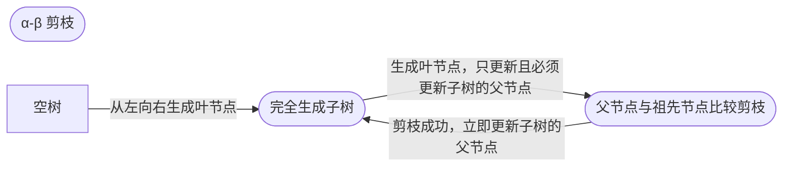
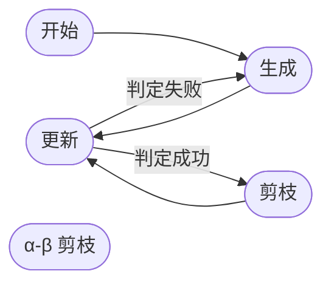
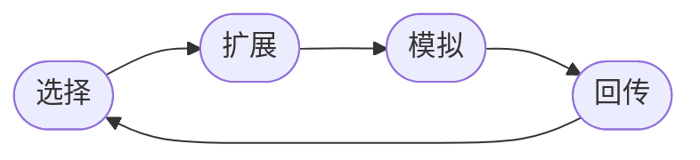

# 对抗搜索

讲的很玄学的一章，玄学到我都忘了这一章讲了啥…

听说四子棋 $\alpha-\beta$ 剪枝也能做，反正我是抄的 MCTS …

# $\alpha-\beta$ 剪枝

## 算法描述

整个 $α-β$ 剪枝的核心思想就是，**当你知道选择 B 不如 A 好，那么你就不需要知道 B 有多坏**

极大节点的下界为 $\alpha$，极小节点的上界为 $\beta$ ，前枝的条件：

>  后辈节点的 $\beta$ 值 $\le$ 祖先节点的 $\alpha$ 值时, $\alpha$ 前枝
>
>  后辈节点的 $\alpha$ 值 $\geq$ 祖先节点的 $\beta$ 值时, $\beta$ 剪枝

后辈**极小节点上界小于祖辈极大节点下界 $\alpha$ 剪** or 后辈**极大节点下界大于祖辈极小节点上界 $\beta$ 剪**

**小节点小于 $\alpha$，大节点大于 $\beta $**

## 算法理解

实际上，第一个点传到极小节点，他就是极小节点的上界，以后极小节点不可能不比这个点的值大了。同理，第一个点传到极大节点，他就是极大节点的下界，以后极大节点不可能比这个值小了。

算法流程：

1. 输入初始图，注意初始的图只有最左下角叶节点的节点的值，然后每次评估函数会从左向右给出新叶节点的值而我们生成和剪枝的是内部节点

2. 从左下角第一个叶节点开始，每当一个内部节点 $k$ 的子节点被完全生成（被剪枝也算是生成，叶节点没有子节点初始化就已经算是被完全生成）才完全生成这个内部节点的值，并且将此内部节点的值传递给父节点进行更新（包括初始化）。父节点更新后再立刻与所有祖辈异号节点比较决定剪枝。

3. 对于父节点未完全生成的其他侧枝，按照规则生成并考虑剪枝。

4. 注意，剪枝需要与所有长辈异极大极小性的节点比较，**且剪枝可以取等号**。

查看目录下的 `IAI_GEN` 文件有无数道练习题，感谢 lambda 治好了孩子剪不对的毛病！（太难全对了）

**生成，更新，判定，剪枝**

判定成功，剪枝更新。判定失败，生成更新。

# 蒙特卡洛方法

$\alpha-\beta$ 剪枝依赖于局面评估的准确性，蒙特卡洛是其中一种评估方法。

> 从当前局面的所有可落子点中随机选择一个点落子，重复以上过程，直到胜负可判断为止。经多次模拟后，选择胜率最大的点落子。

## MCTS

1. 将可能出现的状态转移过程用状态树表示（其实就是建树来完成搜索的意思）
2. 从初始状态开始重复抽样，逐步扩展树中的节点
3. 父节点可以利用子节点的模拟结果，提高了效率
4. 在搜索过程中可以随时得到行为的评价

树搜索过程：

### 选择策略

1. 对尚未充分了解的节点的探索
2. 对当前具有较大希望节点的利用

多臂老虎机模型：也即 UCB1 算法（我真没看出来和老虎机有啥关系…）

节点不是随机选择，而是根据 UCB1 选择信心上限值最大的节点

实际计算 UCB1 时，加一个参数 c 进行调节
$$
I_{j}=\bar{X}_{j}+c \sqrt{\frac{2 \ln (n)}{T_{j}(n)}}
$$

> ### 选择
>
> 在选择阶段，需要从根节点，也就是要做决策的局面 R 出发向下选择出一个最急迫需要被拓展的节点 N，局面 R 是每一次迭代中第一个被检查的节点；
>
> 对于被检查的局面而言，他可能有三种可能：
>
> 1. 该节点所有可行动作（即所有子节点）都已经被拓展过
> 2. 该节点有可行动作（还有子节点）还未被拓展过
> 3. 这个节点游戏已经结束嘞(例如已经连成四子的四子棋局面)
>
> 对于这三种可能：
>
> 1. 如果所有可行动作都已经被拓展过，即所有子节点都有了战绩，那么我们将使用 UCB 公式计算该节点所有子节点的 UCB 值，并找到值最大的一个子节点继续向下迭代。
> 2. 如果被检查的节点 A 依然存在没有被拓展的子节点 B (也即还有战绩为 0/0 的节点)，那么我们认为 A 节点就是本次迭代选择的目标节点，紧接着对 A 进行扩展。
> 3. 如果被检查到的节点是一个游戏已经结束的节点。那么从该节点直接记录战绩，并且反向传播。
>
> ### 扩展
>
> 在选择阶段结束时候，我们查找到了一个最迫切被拓展的节点 N，以及他一个尚未拓展的动作 A。在搜索树中创建一个新的节点 $N_A$ 作为 N 的一个新子节点，$N_A$ 的局面就是节点 N 在执行了动作 A 之后的局面。
>
> ### 模拟
>
> 为了让 $N_A$ 得到一个初始的评分,我们从 $N_A$ 开始，让游戏随机进行，直到得到一个游戏结局，这个结局将作为 $N_A$ 的初始战绩，采用 $\frac{胜场}{总次数}$来记录。
>
> ### 回传
>
>  在 $N_A$ 的模拟结束之后，它的父节点 n 以及从根节点到 N 的路径上的所有节点都会根据本次模拟的结果来添加自己的累计评分，注意评分具有交替性。如果在选择阶段直接造成了游戏结局，则跳过模拟，根据该结局来更新评分。
>
> **注意马老师的回传过程是要变号的！这是在每次都能选择最大 UCB1 值的理论基础**

有孙辈节点的节点 A 一定是被完全扩展了的，因为孙辈 C 被生成意味着儿辈 B 被选择，而若 A 自身被选择，则不可能选择 A 的儿子 B。

# AlphaGo 原理

蒙特卡洛树搜索存在的问题

1. 生成所有子节点，搜索范围过大

2. 模拟具有盲目性，有效模拟比例较低

AlphaGo 将神经网络与蒙特卡洛树搜索结合在一起

1. 缩小了搜索范围
2. 提高了模拟水平

## 策略网络

训练数据:

16 万盘人类棋手的数据

等效为一个分类问题：

任意一个棋局分类为三百六十一类之一，人类行棋点为标记

损失函数:
$$
L(w)=-t_{a} \log \left(p_{a}\right)
$$
$t_{a}$ : 当前棋局下棋手落子在 $\mathrm{a}$ 处时为 1 , 否则为 0

$p_{a}$ : 策略网络在 $\mathrm{a}$ 出落子的概率

## 收益网络

估值网络由一个神经网络构成 输入: 当前棋局

49个通道, 每个通道大小为 $19 * 19$

比策略网络多一个通道

输出：当前棋局的收益

收益的取值范围为 $[-1,1]$

## 估值网络

训练样本

16 万人类棋手的数据

等效为一个回归问题

获胜时收益为 1 , 失败时收益为-1

损失函数
$$
L(w)=(R-V(s))^{2}
$$
$\mathrm{R}$ 为棋局的胜负, 胜为 1 , 负为 $-1$

$\mathrm{V}(\mathrm{s})$ 为估值网络的输出，即预测的收益。

## MCTS 中的选择原则

利用：收益好的节点

探索：模拟次数少的节点

AlphaGo 增加了第三个原则

经验：落子概率高的节点

充分利用两个网络

## 对 MCTS 的修改

- 节点 $\mathrm{s}$ 第 I 次模拟的收益

$$
v_{i}(s)=\lambda \text { value }(s)+(1-\lambda) \operatorname{rollout}(s)
$$
其中: value $(s)$ 是估值网络的输出, rollout $(s)$ 是一次模拟结果 平均收益
$$
Q\left(s_{a}\right)=\frac{\sum_{i=1}^{n} v_{i}\left(s_{a}\right)}{n}
$$
其中: $\mathrm{s}_{a}$ 为 $\mathrm{s}$ 棋局下在 $\mathrm{a}$ 处落子后的棋局

- 探索项

$$
u\left(s_{a}\right)=c \cdot p\left(s_{a}\right) \frac{\sqrt{N(s)}}{N\left(s_{a}\right)+1}
$$
其中: $N(\cdot)$ 为模拟次数、 $p\left(s_{a}\right)$ 为策略网络在 $\mathrm{a}$ 出下棋的概率, $\mathrm{c}$ 为加权系数

- 选择过程

  1. 用 $Q\left(s_{a}\right)+u\left(s_{a}\right)$ 代替信心上限 $I_{j}$
  2. 优先选择 $Q\left(s_{a}\right)+u\left(s_{a}\right)$ 大的子节点
  3. 遇到叶节点 $s_{l}$ 结束, 该节点被选中

- 生成过程

  1. 生成 $s_{l}$ 的所有子节点
  2. 规定了最大的节点深度

- 模拟过程

  1. 对 $s_{l}$ 进行模拟, 计算：$v_{i}(s)=\lambda \operatorname{value}(s)+(1-\lambda) \operatorname{rollout}(s)$
  2. 模拟过程采用推演策略网络
  3. 推演策略网络速度快是策略网络的 1000 倍
  4. 规定了总的模拟次数

- 节点记录的信息
  1. 总收益
  2. 行棋到该节点的概率
  3. 被选择次数

- 选择依据

	1. 根节点子节点中被选择次数最多的节点作为最终的走步

## 总结

1. AlphaGo 的基本框架是 MCTS
2. 在 MCTS 中引入了策略网络和估值网络
3. 收益计算综合了估值网络的输出和模拟结果
4. 在选择过程中, 考虑了行棋概率
5. 利用推演策略网络进行模拟
6. 限定了 MCTS 的最大深度
7. 限定了 MCTS 的总模拟次数

# 强化学习

- 学习“做什么才能使得收益最大化”的方法
- 学习者不会被告知如何做, 必须自己通过尝试发现哪些动作会产生最大的收益
- 两个特征：试错和延迟收益
- 深度强化学习——用深度学习 (神经网络) 方法实现的强化学习

## 关键问题

- 如何获得指示信号
- 监督学习: 情景与标注一一对应
- 强化学习: 将收益转化为 “标注”
- 不能获得所有情况下既正确又有代表性的示例
- 手段: 将深度强化学习问题转化为神经网络训练问题
- 不同的转换方法构成了不同的深度学习方法
- 关键是损失函数的定义

## 三种实现方法

- 基于策略梯度的强化学习
- 基于价值评估的强化学习
- 基于演员-评价方法的强化学习

1. 在强化学习过程中，每个样本只使用一次
2. 基于策略梯度的强化学习方法学到的是在每个可落子点行棋的获胜概率
3. 监督学习策略网络学到的是在某个可落子点行棋的概率

基于策略梯度的强化, 通过每局棋的胜负指导学习, 学习到的是每个落 子点获胜的概率

基于价值评估的强化学习, 通过每局棋的胜负指导学习, 学习到的是每 个落子点获取最大收益的概率

基于演员-评价的强化学习, 强调的是重要行棋点的学习, 通过收益增量对走法的重要性进行评价, 学习到的是每个落子点获得最大收益增量的概率
