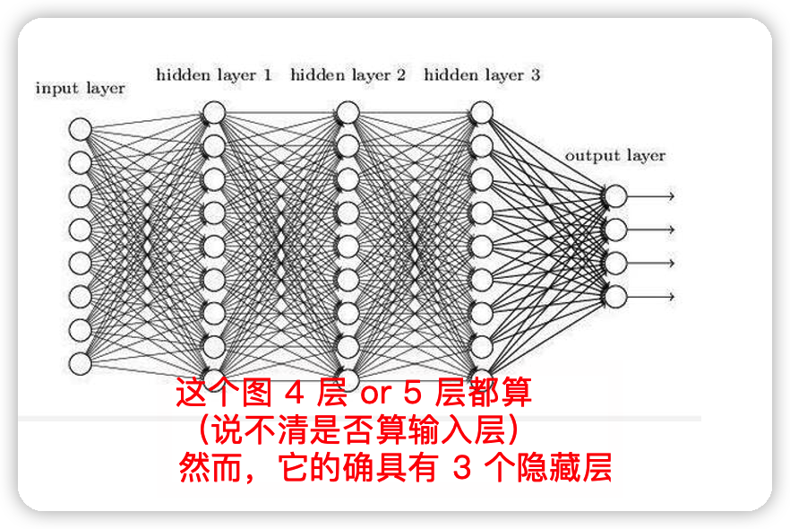
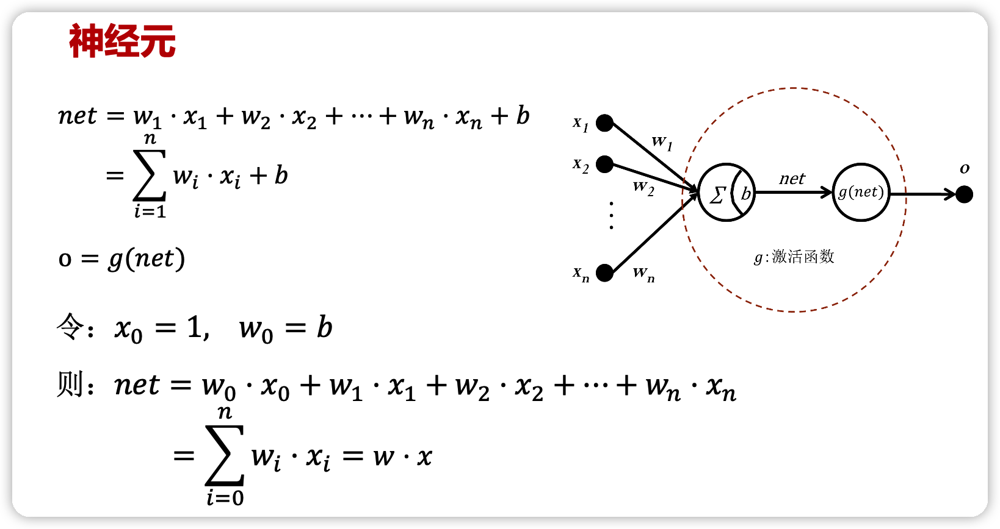
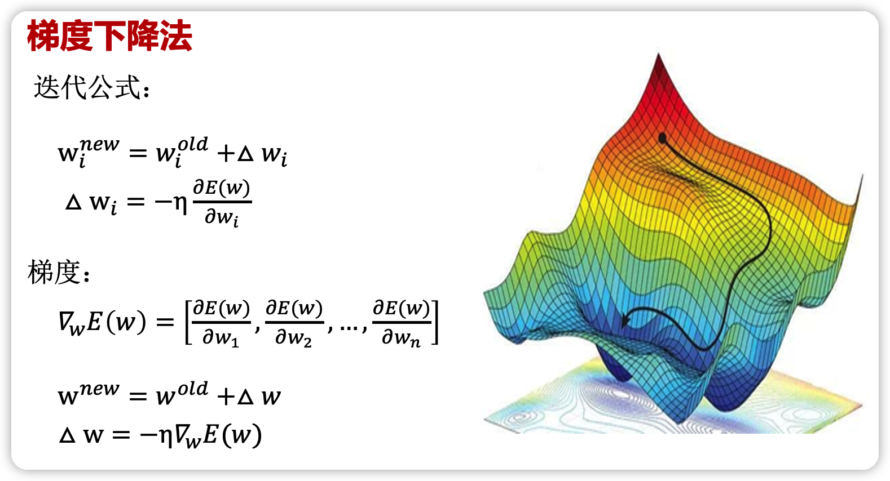

# readme

这一章马老师讲的很玄学，尽我所能写一写…

# What is neural network？

## 术语

1. **全连接神经网络** —— 对 n-1 层和 n 层而言，n-1 层的任意一个节点，都和第 n 层所有节点有连接。即第 n 层的每个节点在进行计算的时候，[激活函数](https://so.csdn.net/so/search?q=激活函数&spm=1001.2101.3001.7020)的输入是 n-1 层所有节点的加权，这个激活函数是非线性的，可作用于大多数场景，然而**权重过多，计算量很大。**
2. **前馈神经网络** —— 在其内部，参数从输入层向输出层单向传播。有异于[循环神经网络](https://zh.wikipedia.org/wiki/循环神经网络)，它的内部不会构成[有向环](https://zh.wikipedia.org/wiki/環_(圖論))。
3. **多层感知器** ——（Multilayer Perceptron,缩写MLP）是一种前向结构的[人工神经网络](https://zh.m.wikipedia.org/wiki/人工神经网络)，映射一组输入向量到一组输出向量。MLP可以被看作是一个有向图，由多个的节点层所组成，每一层都全连接到下一层。除了输入节点，每个节点都是一个带有非线性激活函数的神经元（或称处理单元）。一种被称为[反向传播算法](https://zh.m.wikipedia.org/wiki/反向传播算法)的[监督学习](https://zh.m.wikipedia.org/wiki/监督学习)方法常被用来训练MLP。多层感知器遵循人类神经系统原理，学习并进行数据预测。它首先学习，然后使用权重存储数据，并使用算法来调整权重并减少训练过程中的偏差，即实际值和预测值之间的误差。主要优势在于其快速解决复杂问题的能力。多层感知的基本结构由三层组成：第一输入层，中间隐藏层和最后输出层，输入元素和权重的乘积被馈给具有神经元偏差的求和结点,主要优势在于其快速解决复杂问题的能力。MLP是[感知器](https://zh.m.wikipedia.org/wiki/感知器)的推广，克服了感知器不能对[线性不可分](https://zh.m.wikipedia.org/w/index.php?title=线性不可分&action=edit&redlink=1)数据进行识别的弱点。
4. **全连接层** —— Fully Connected Layer 类似 FCN
5. **稠密层** —— 即 FCL 的同义词

## 结构与激活函数

通过增设 0 项可以统一形式，不必单独写偏置量。

### Identity

优点：适合于潜在行为是线性（与线性回归相似）的任务。

缺点：无法提供非线性映射，当多层网络使用identity激活函数时，整个网络就相当于一个单层模型。

### sigmoid

一般论文中的 $\sigma$ 专指 sigmoid。连续，用的多。

函数定义：
$$
{ f }(x)=\sigma (x)=\frac { 1 }{ 1+{ e }^{ -x } }
$$
导数：

$$
{ f }^{ ' }(x)=f(x)(1-f(x))
$$

优点：
1. $sigmoid$ 函数的输出映射在 $(0,1)$ 之间，单调连续，输出范围有限，优化稳定，可以用作输出层；
2. 求导容易；

缺点：
1. 由于其软饱和性，一旦落入饱和区梯度就会接近于0，根据反向传播的链式法则，容易产生梯度消失，导致训练出现问题；
2. Sigmoid 函数的输出恒大于 0。非零中心化的输出会使得其后一层的神经元的输入发生偏置偏移（Bias Shift），并进一步使得梯度下降的收敛速度变慢；
3. 计算时，由于具有幂运算，计算复杂度较高，运算速度较慢。

### tanh

取值范围在 `(-1, 1)`，可经过简单变换变成 sigmoid。

函数定义：

$$
{ f }(x)=tanh(x)=\frac { { e }^{ x }-{ e }^{ -x } }{ { e }^{ x }+{ e }^{ -x } }
$$

导数：

$$
{ f }^{ ' }(x)=1-f(x)^{ 2 }
$$

函数图形如 **图4** 所示：

优点：
1. $tanh$ 比 $sigmoid$ 函数收敛速度更快；
2. 相比 $sigmoid$ 函数，$tanh$ 是以 $0$ 为中心的；

缺点：
1. 与 $sigmoid$ 函数相同，由于饱和性容易产生的梯度消失；
2. 与 $sigmoid$ 函数相同，由于具有幂运算，计算复杂度较高，运算速度较慢。

### ReLU

线性整流函数，整流这个词来自二极管。

函数定义：

$$
f(x)=\begin{cases} \begin{matrix} 0 & x<0 \end{matrix} \\ \begin{matrix} x & x\ge 0 \end{matrix} \end{cases}
$$
导数：

$$
{ { f }(x) }^{ ' }=\begin{cases} \begin{matrix} 0 & x<0 \end{matrix} \\ \begin{matrix} 1 & x\ge 0 \end{matrix} \end{cases}
$$

优点：
1. 收敛速度快；
2. 相较于 $sigmoid$ 和 $tanh$ 中涉及了幂运算，导致计算复杂度高， ReLU可以更加简单的实现；
3. 当输入 $x>=0$ 时，ReLU 的导数为常数，这样可有效缓解梯度消失问题；
4. 当 $x<0$ 时，ReLU 的梯度总是 $0$，提供了神经网络的稀疏表达能力；

缺点：
1. ReLU 的输出不是以 $0$ 为中心的；
2. 神经元坏死现象，某些神经元可能永远不会被激活，导致相应参数永远不会被更新；
3. 不能避免梯度爆炸问题；

### softmax

在输出时，作用在整个层上，输出的和为 1，可视为概率。

softmax 函数一般用于多分类问题中，它是对逻辑斯蒂（logistic）回归的一种推广，也被称为多项逻辑斯蒂回归模型(multi-nominal logistic mode)。假设要实现 k 个类别的分类任务，Softmax 函数将输入数据 $x_i$ 映射到第 $i$ 个类别的概率 $y_i$ 如下计算：

$$
y_i=soft\max \left( x_i \right) =\frac{e^{x_i}}{\sum_{j=1}^k{e^{x_j}}}
$$

显然，$0<y_i<1$。下图给出了三类分类问题的  softmax 输出示意图。在图中，对于取值为 4、1和-4 的 $x_1$、$x_2$ 和 $x_3$，通过 softmax 变换后，将其映射到 (0,1) 之间的概率值。

由于 softmax 输出结果的值累加起来为 1，因此可将输出概率最大的作为分类目标。

也可以从如下另外一个角度来理解：给定某个输入数据，可得到其分类为三个类别的初始结果，分别用 $x_1$、$x_2$ 和 $x_3$ 来表示。这三个初始分类结果分别是 4、1和 -4。通过 Softmax 函数，得到了三个类别分类任务中以概率表示的更好的分类结果，即分别以 95.25%、4.71% 和 0.04% 归属于类别 1、类别 2 和类别 3。显然，基于这样的概率值，可判断输入数据属于第一类。可见，通过使用 Softmax 函数，可求取输入数据在所有类别上的概率分布。

## 如何训练与损失函数

### 梯度下降法

1. 梯度是指增长最快的方向，故而需要加上梯度的相反数
2. 