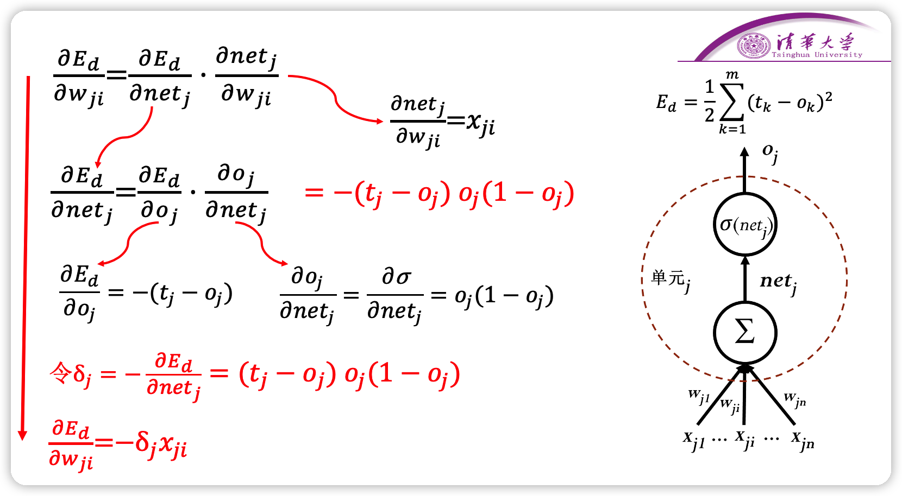
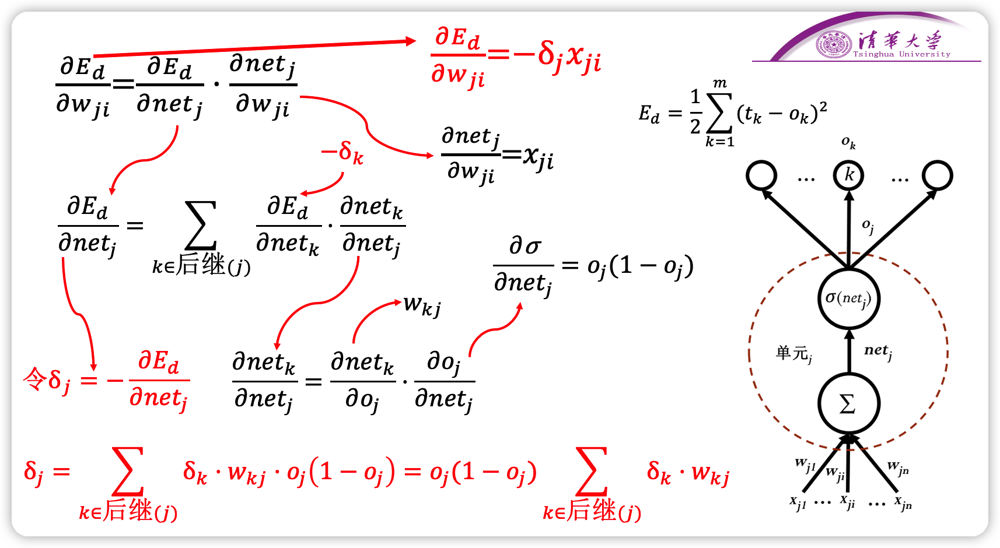
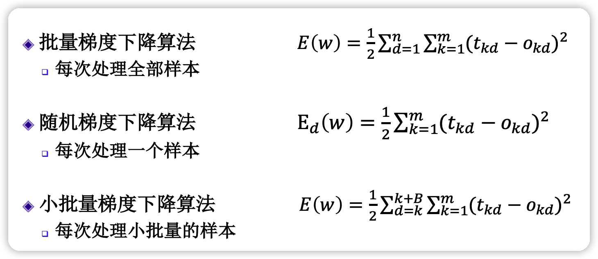
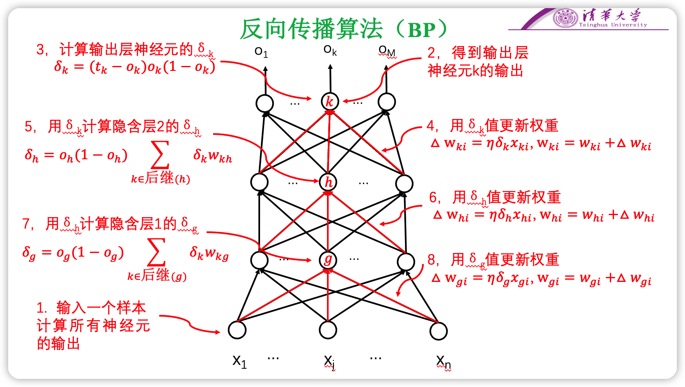
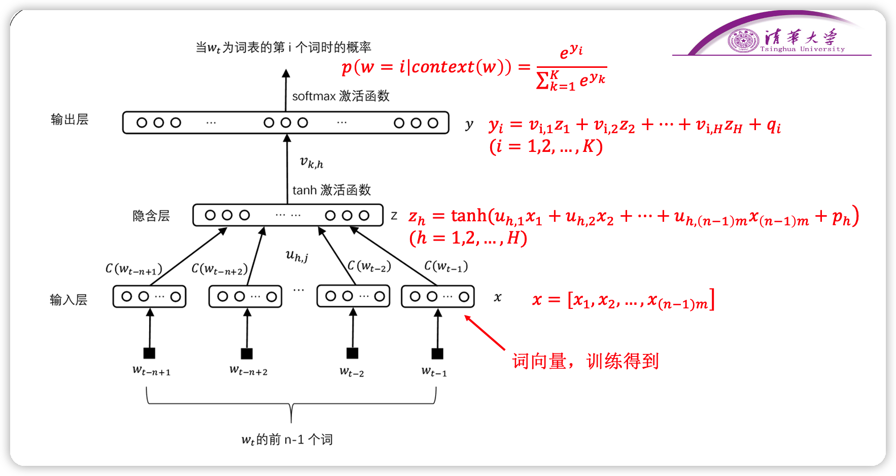
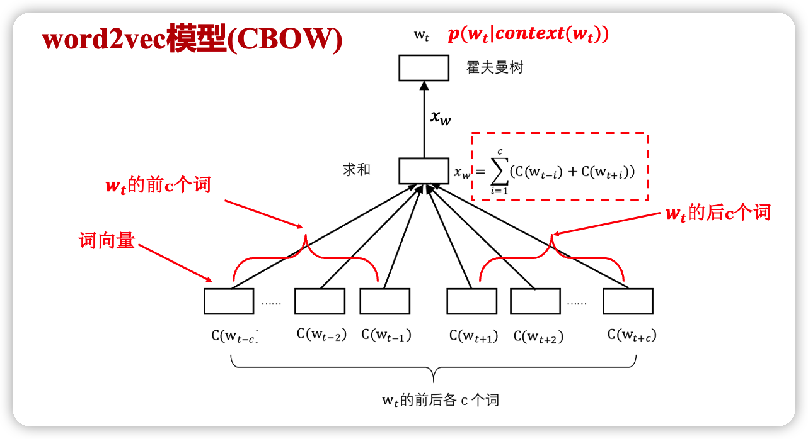
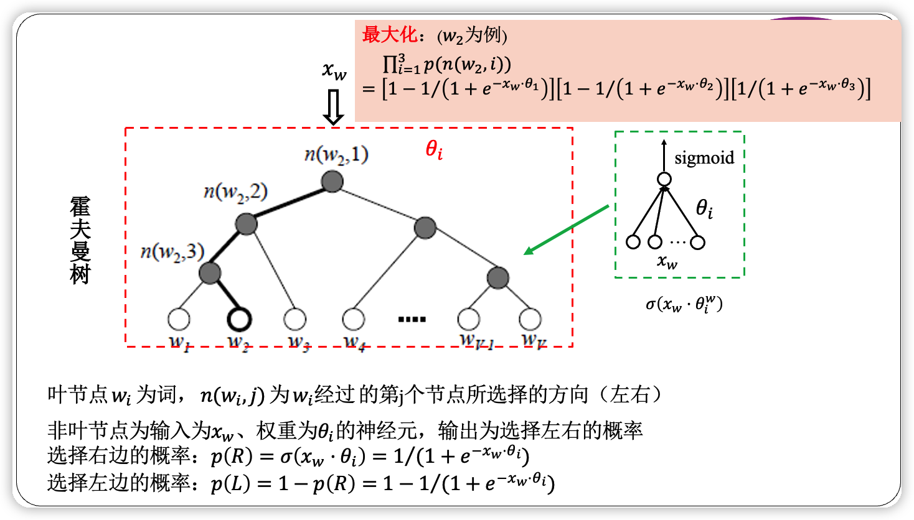
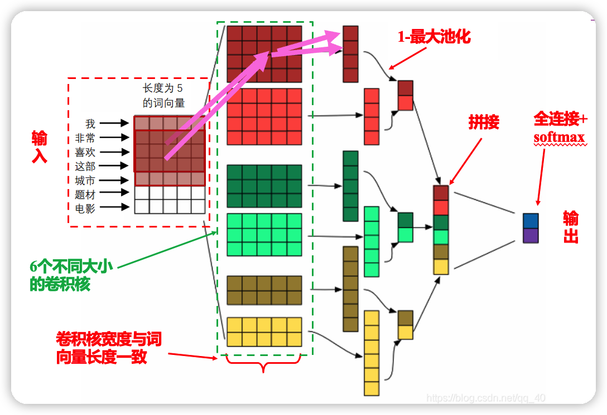

# readme

这一章马老师讲的很玄学，尽我所能写一写…

Credit to [Eren Zhao](https://zhaochenyang20.github.io/) and [saltyp0rridge](https://saltyp0rridge.github.io/).

# What is neural network？

## 术语

1. **全连接神经网络** —— 对 n-1 层和 n 层而言，n-1 层的任意一个节点，都和第 n 层所有节点有连接。即第 n 层的每个节点在进行计算的时候，[激活函数](https://so.csdn.net/so/search?q=激活函数&spm=1001.2101.3001.7020)的输入是 n-1 层所有节点的加权，这个激活函数是非线性的，可作用于大多数场景，然而**权重过多，计算量很大。**
2. **前馈神经网络** —— 在其内部，参数从输入层向输出层单向传播。有异于[循环神经网络](https://zh.wikipedia.org/wiki/循环神经网络)，它的内部不会构成[有向环](https://zh.wikipedia.org/wiki/環_(圖論))。
3. **多层感知器** ——（Multilayer Perceptron,缩写MLP）是一种前向结构的[人工神经网络](https://zh.m.wikipedia.org/wiki/人工神经网络)，映射一组输入向量到一组输出向量。MLP可以被看作是一个有向图，由多个的节点层所组成，每一层都全连接到下一层。除了输入节点，每个节点都是一个带有非线性激活函数的神经元（或称处理单元）。一种被称为[反向传播算法](https://zh.m.wikipedia.org/wiki/反向传播算法)的[监督学习](https://zh.m.wikipedia.org/wiki/监督学习)方法常被用来训练MLP。多层感知器遵循人类神经系统原理，学习并进行数据预测。它首先学习，然后使用权重存储数据，并使用算法来调整权重并减少训练过程中的偏差，即实际值和预测值之间的误差。主要优势在于其快速解决复杂问题的能力。多层感知的基本结构由三层组成：第一输入层，中间隐藏层和最后输出层，输入元素和权重的乘积被馈给具有神经元偏差的求和结点,主要优势在于其快速解决复杂问题的能力。MLP是[感知器](https://zh.m.wikipedia.org/wiki/感知器)的推广，克服了感知器不能对[线性不可分](https://zh.m.wikipedia.org/w/index.php?title=线性不可分&action=edit&redlink=1)数据进行识别的弱点。
4. **全连接层** —— Fully Connected Layer 类似 FCN
5. **稠密层** —— 即 FCL 的同义词

## 结构与激活函数

通过增设 0 项可以统一形式，不必单独写偏置量。

### Identity

优点：适合于潜在行为是线性（与线性回归相似）的任务。

缺点：无法提供非线性映射，当多层网络使用 identity 激活函数时，整个网络就相当于一个单层模型。

### sigmoid

一般论文中的 $\sigma$ 专指 sigmoid。连续，用的多。

函数定义：
$$
{ f }(x)=\sigma (x)=\frac { 1 }{ 1+{ e }^{ -x } }
$$
导数：

$$
{ f }^{ ' }(x)=f(x)(1-f(x))
$$

优点：
1. $sigmoid$ 函数的输出映射在 $(0,1)$ 之间，单调连续，输出范围有限，优化稳定，可以用作输出层；
2. 求导容易；

缺点：
1. 由于其软饱和性，一旦落入饱和区梯度就会接近于0，根据反向传播的链式法则，容易产生梯度消失，导致训练出现问题；
2. Sigmoid 函数的输出恒大于 0。非零中心化的输出会使得其后一层的神经元的输入发生偏置偏移（Bias Shift），并进一步使得梯度下降的收敛速度变慢；
3. 计算时，由于具有幂运算，计算复杂度较高，运算速度较慢。

### tanh

取值范围在 `(-1, 1)`，可经过简单变换变成 sigmoid。

函数定义：

$$
{ f }(x)=tanh(x)=\frac { { e }^{ x }-{ e }^{ -x } }{ { e }^{ x }+{ e }^{ -x } }
$$

导数：

$$
{ f }^{ ' }(x)=1-f(x)^{ 2 }
$$

函数图形如**图 4** 所示：

优点：
1. $tanh$ 比 $sigmoid$ 函数收敛速度更快；
2. 相比 $sigmoid$ 函数，$tanh$ 是以 $0$ 为中心的；

缺点：
1. 与 $sigmoid$ 函数相同，由于饱和性容易产生的梯度消失；
2. 与 $sigmoid$ 函数相同，由于具有幂运算，计算复杂度较高，运算速度较慢。

### ReLU

线性整流函数，整流这个词来自二极管。

函数定义：

$$
f(x)=\begin{cases} \begin{matrix} 0 & x<0 \end{matrix} \\ \begin{matrix} x & x\ge 0 \end{matrix} \end{cases}
$$
导数：

$$
{ { f }(x) }^{ ' }=\begin{cases} \begin{matrix} 0 & x<0 \end{matrix} \\ \begin{matrix} 1 & x\ge 0 \end{matrix} \end{cases}
$$

优点：
1. 收敛速度快；
2. 相较于 $sigmoid$ 和 $tanh$ 中涉及了幂运算，导致计算复杂度高， ReLU 可以更加简单的实现；
3. 当输入 $x>=0$ 时，ReLU 的导数为常数，这样可有效缓解梯度消失问题；
4. 当 $x<0$ 时，ReLU 的梯度总是 $0$，提供了神经网络的稀疏表达能力；

缺点：
1. ReLU 的输出不是以 $0$ 为中心的；
2. 神经元坏死现象，某些神经元可能永远不会被激活，导致相应参数永远不会被更新；
3. 不能避免梯度爆炸问题；

### softmax

在输出时，作用在整个层上，输出的和为 1，可视为概率。

softmax 函数一般用于多分类问题中，它是对逻辑斯蒂（logistic）回归的一种推广，也被称为多项逻辑斯蒂回归模型(multi-nominal logistic mode)。假设要实现 k 个类别的分类任务，Softmax 函数将输入数据 $x_i$ 映射到第 $i$ 个类别的概率 $y_i$ 如下计算：

$$
y_i=soft\max \left( x_i \right) =\frac{e^{x_i}}{\sum_{j=1}^k{e^{x_j}}}
$$

显然，$0<y_i<1$。下图给出了三类分类问题的  softmax 输出示意图。在图中，对于取值为 4、1和-4 的 $x_1$、$x_2$ 和 $x_3$，通过 softmax 变换后，将其映射到 (0,1) 之间的概率值。

由于 softmax 输出结果的值累加起来为 1，因此可将输出概率最大的作为分类目标。

也可以从如下另外一个角度来理解：给定某个输入数据，可得到其分类为三个类别的初始结果，分别用 $x_1$、$x_2$ 和 $x_3$ 来表示。这三个初始分类结果分别是 4、1和 -4。通过 Softmax 函数，得到了三个类别分类任务中以概率表示的更好的分类结果，即分别以 95.25%、4.71% 和 0.04% 归属于类别 1、类别 2 和类别 3。显然，基于这样的概率值，可判断输入数据属于第一类。可见，通过使用 Softmax 函数，可求取输入数据在所有类别上的概率分布。

## 如何训练与损失函数

### 梯度下降法

1. 梯度是指增长最快的方向，故而需要加上梯度的相反数
2. 在多维情况下，梯度计算较为复杂，可以改为偏导数

### 手动计算

这张图对于 sigmoid 情况下的梯度下降说的很清楚。

注意，这里 k 是 j 的后续，而不前驱，也即右图中 k 在 j 上方。 

### 梯度下降算法

 **批量梯度下降**

标准的梯度下降，即批量梯度下降（batch gradient descent, BGD），在整个训练集上计算损失函数关于参数 $\theta$ 的梯度。

$$
\theta=\theta-\eta \nabla_{\theta}J(\theta)
$$
其中 $\theta$ 是模型的参数，$\eta$ 是学习率，$\nabla_{\theta}J(\theta)$ 为损失函数对参数 $\theta$ 的导数。由于为了一次参数更新我们需要在整个训练集上计算梯度，导致 BGD 可能会非常慢，而且在训练集太大而不能全部载入内存的时候会很棘手。BGD 也不允许我们在线更新模型参数，即实时增加新的训练样本。

BGD 对于凸误差曲面（convex error surface）保证收敛到全局最优点，而对于非凸曲面（non-convex surface）则是局部最优点。

缺点：收敛缓慢，容易陷入局部极值点

**随机梯度下降**

随机梯度下降（ stotastic gradient descent, SGD ）则是每次使用一个训练样本 $x^{i}$ 和标签 $y^{i}$ 进行一次参数更新。

$$
\theta=\theta -\eta \cdot \nabla_{\theta}J(\theta;x^i;y^i)
$$
其中 $\theta$ 是模型的参数，$\eta$ 是学习率，$\nabla_{\theta}J(\theta)$ 为损失函数对参数 $\theta$ 的导数。BGD 对于大数据集来说执行了很多冗余的计算，因为在每一次参数更新前都要计算很多相似样本的梯度。SGD 通过一次执行一次更新解决了这种冗余。因此通常 SGD 的速度会非常快而且可以被用于在线学习。SGD 以高方差的特点进行连续参数更新，导致目标函数严重震荡。

BGD 能够收敛到（局部）最优点，然而 SGD 的震荡特点导致其可以跳到新的潜在的可能更好的局部最优点。已经有研究显示当我们慢慢的降低学习率时，SGD 拥有和 BGD 一样的收敛性能，对于非凸和凸曲面几乎同样能够达到局部或者全局最优点。

**Mini-batch 梯度下降**

Mini-batch gradient descent（ mini-batch gradient descent, MBGD ）则是在上面两种方法中采取了一个折中的办法：每次从训练集中取出$batch  size$个样本作为一个mini-batch，以此来进行一次参数更新。

$$
\theta=\theta -\eta \cdot \nabla_{\theta} J(\theta;x^{(i:i+n);y^{(i:i+n)}})
$$
其中 $\theta$ 是模型的参数，$\eta$ 是学习率，$\nabla_{\theta} J(\theta;x^{(i:i+n);y^{(i:i+n)}}$ 为损失函数对参数 $\theta$ 的导数，n 为 Mini-bach的大小（batch size）。 batch size 越大，批次越少，训练时间会更快一点，但可能造成数据的很大浪费；而 batch size 越小，对数据的利用越充分，浪费的数据量越少，但批次会很大，训练会更耗时。

**优点**

+ 减小参数更新的方差，这样可以有更稳定的收敛。
+ 利用现在最先进的深度学习库对矩阵运算进行了高度优化的特点，这样可以使得计算 mini-batch 的梯度更高效。

样本数目较大的话，一般的 mini-batch 大小为 64 到 512，考虑到电脑内存设置和使用的方式，如果mini-batch 大小是 $2^n$，代码会运行地快一些。

MBGD 是训练神经网络时的常用方法，而且通常即使实际上使用的是 MBGD，也会使用 SGD 这个词来代替。

### **Back Propagation**

误差反向传播算法，给出了一种计算偏导数的方法。

## cross entropy

在物理学中，“熵”被用来表示热力学系统所呈现的无序程度。香农将这一概念引入信息论领域，提出了“信息熵”概念，通过对数函数来测量信息的不确定性。

交叉熵（cross entropy）是信息论中的重要概念，主要用来度量两个概率分布间的差异。假定 $p$ 和 $q$ 是数据 $x$ 的两个概率分布，通过 $q$ 来表示 $p$ 的交叉熵可如下计算：

$$
H\left( p,q \right) =-\sum_x{p\left( x \right) \log q\left( x \right)}
$$

交叉熵刻画了两个概率分布之间的距离，旨在描绘通过概率分布 $q$ 来表达概率分布 $p$ 的困难程度。根据公式不难理解，交叉熵越小，两个概率分布 $p$ 和 $q$ 越接近。

这里仍然以三类分类问题为例，假设数据 $x$ 属于类别 $1$。记数据 $x$ 的类别分布概率为 $y$，显然 $y=(1,0,0)$ 代表数据 $x$ 的实际类别分布概率。记 $\hat{y}
$ 代表模型预测所得类别分布概率。

那么对于数据 $x$ 而言，其实际类别分布概率 $y$ 和模型预测类别分布概率 $\hat{y}$ 的交叉熵损失函数定义为：

$$
cross\ entropy=-y\times \log \left( \hat{y} \right)
$$

很显然，一个良好的神经网络要尽量保证对于每一个输入数据，神经网络所预测类别分布概率与实际类别分布概率之间的差距越小越好，即交叉熵越小越好。于是，可将交叉熵作为损失函数来训练神经网络。

上图给出了一个三个类别分类的例子。由于输入数据 $x$ 属于类别 $1$，因此其实际类别概率分布值为 $y=(y_1,y_2,y_3)=(1,0,0)$。经过神经网络的变换，得到了输入数据 $x$ 相对于三个类别的预测中间值 $(z1,z2,z3)$。然后，经过 $Softmax$ 函数映射，得到神经网络所预测的输入数据 $x$ 的类别分布概率 $\hat{y}=\left( \hat{y}_1,\hat{y}_2,\hat{y}_3 \right)$。根据前面的介绍，$\hat{y}_1$、$\hat{y}_2$ 和 $\hat{y}_3$ 为 $(0,1)$ 范围之间的一个概率值。由于样本 $x$ 属于第一个类别，因此希望神经网络所预测得到的 $\hat{y}_1$取值要远远大于 $\hat{y}_2$ 和 $\hat{y}_3$ 的取值。为了得到这样的神经网络，在训练中可利用如下交叉熵损失函数来对模型参数进行优化：
$$
cross\ entropy=-\left( y_1\times \log \left( \hat{y}_1 \right) +y_2\times \log \left( \hat{y}_2 \right) +y_3\times \log \left( \hat{y}_3 \right) \right) 
$$

在上式中，$y_2$ 和 $y_3$ 均为 $0$、$y_1$ 为 $1$，因此交叉熵损失函数简化为：
$$
-y_1\times \log \left( \hat{y}_1 \right) =-\log \left( \hat{y}_1 \right) 
$$

在神经网络训练中，要将输入数据实际的类别概率分布与模型预测的类别概率分布之间的误差（即损失）从输出端向输入端传递，以便来优化模型参数。下面简单介绍根据交叉熵计算得到的误差从 $\hat{y}_1$ 传递给 $z_1$ 和 $z_2$（$z_3$ 的推导与 $z_2$ 相同）的情况。

$$
\frac{\partial \hat{y}_1}{\partial z_1}=\frac{\partial \left( \frac{e^{z_1}}{\sum_k{e^{z_k}}} \right)}{\partial z_1}=\frac{\left( e^{z_1} \right) ^{'}\times \sum_k{e^{z_k}-e^{z_1}\times e^{z_1}}}{\left( \sum_k{e^{z_k}} \right) ^2}=\frac{e^{z_1}}{\sum_k{e^{z_k}}}-\frac{e^{z_1}}{\sum_k{e^{z_k}}}\times \frac{e^{z_1}}{\sum_k{e^{z_k}}}=\hat{y}_1\left( 1-\hat{y}_1 \right) 
$$

由于交叉熵损失函数 $-\log \left( \hat{y}_1 \right)$ 对 $\hat{y}_1$ 求导的结果为 $-\frac{1}{\hat{y}_1}$，$\hat{y}_1\left( 1-\hat{y}_1 \right)$ 与 $-\frac{1}{\hat{y}_1}$ 相乘为 $\hat{y}_1-1$。这说明一旦得到模型预测输出 $\hat{y}_1$，将该输出减去1就是交叉损失函数相对于 $z_1$ 的偏导结果。

$$
\frac{\partial \hat{y}_1}{\partial z_2}=\frac{\partial \left( \frac{e^{z_1}}{\sum_k{e^{z_k}}} \right)}{\partial z_2}=\frac{0\times \sum_k{e^{z_k}-e^{z_1}\times e^{z_2}}}{\left( \sum_k{e^{z_k}} \right) ^2}=-\frac{e^{z_1}}{\sum_k{e^{z_k}}}\times \frac{e^{z_2}}{\sum_k{e^{z_k}}}=-\hat{y}_1\hat{y}_2
$$

同理，交叉熵损失函数导数为 $-\frac{1}{\hat{y}_1}$，$-\hat{y}_1\hat{y}_2$ 与 $-\frac{1}{\hat{y}_1}$ 相乘结果为 $\hat{y}_2$。这意味对于除第一个输出节点以外的节点进行偏导，在得到模型预测输出后，只要将其保存，就是交叉损失函数相对于其他节点的偏导结果。在 $z_1$、$z_2$ 和 $z_3$得到偏导结果后，再通过链式法则将损失误差继续往输入端传递即可。

在上面的例子中，假设所预测中间值 $(z_1,z_2,z_3)$ 经过 $Softmax$ 映射后所得结果为 $(0.34,0.46,0.20)$。由于已知输入数据 $x$ 属于第一类，显然这个输出不理想而需要对模型参数进行优化。如果选择交叉熵损失函数来优化模型，则 $(z_1,z_2,z_3)$ 这一层的偏导值为 $(0.34-1,0.46,0.20)= (-0.66,0.46,0.20)$。

可以看出，$Softmax$ 和交叉熵损失函数相互结合，为偏导计算带来了极大便利。偏导计算使得损失误差从输出端向输入端传递，来对模型参数进行优化。在这里，交叉熵与$Softmax$ 函数结合在一起，因此也叫 $Softmax$ 损失（Softmax with cross-entropy loss）。

**softmax** 把分类输出标准化成概率分布，**cross-entropy** 刻画预测分类和真实结果概率分布之间的相似度。

# 训练优化

神经网络遇到的两大问题：梯度消失 + 过拟合

## 梯度消失

神经网络并非层数越深越好，层数越深，越越靠近输入处的神经元的梯度越小

比如用 sigmoid，$\delta_h=o_h(1-o_h)\le \frac{1}{4}$，越乘梯度越小

解决思路：

1. 使用 ReLU 激活函数，ReLU 的导数为 1

2. 优化网络结构

> GoogLeNet：
>
> 配合 inception 模块采用辅助输出，中途分支的输出对应更浅层的神经网络，训练时用三个输出共同计算 Loss，辅助输出更靠近输入，可以缓解梯度消失问题
>
> ResNet：
>
> 设输入为 $\boldsymbol{x}$，假设我们希望学出的理想映射为 $f(\boldsymbol{x})$，从而作为激活函数的输入。左图虚线框中的部分需要直接拟合出该映射 $f(\boldsymbol{x})$，而右图虚线框中的部分则需要拟合出有关恒等映射的残差映射 $f(\boldsymbol{x})-\boldsymbol{x}$。残差映射在实际中往往更容易优化。实际中，当理想映射 $f(\boldsymbol{x})$ 极接近于恒等映射时，残差映射也易于捕捉恒等映射的细微波动。右图也是ResNet的基础块，即残差块（residual block）。在残差块中，输入可通过跨层的数据线路更快地向前传播。
>
> 

# 神经网络语言模型

## 词向量

词向量又称为词嵌入（word embedding），是一种将单词表示为向量的方法。

嵌入：满足一定性质的一种变换。

### one-hot 编码

- 用与词表等长的向量表示一个词
- 向量只有一个元素为  1，其余为 0
- 第 i 个元素为 1 的向量用于表示词表中的第 i 个词

**优点**

1. 编码简单

**缺点**

1. 编码太长
2. 无法度量词之间的相似性

### 分布式表示

- 一种压缩表示方法，将词映射到一个较短的向量，用向量的所有位联合表示一个词。
- 可根据需要指定向量的大小。
- 一般语义相近的词在空间中分布相近。

## NNLM 模型

neural network language model，这一块描述的我真的很不理解，私以为和 Viterbi algorithm 那章一样，希望通过神经网络来学习语句内词语的联系，也即前 n-1 个词确定时，第 n 个词的分布概率。

结合这两张图，还是蛮好理解的。

### 如何训练

1. 通过让联合概率最大化估计概率的方法称作最大似然估计

> 联合概率分布一般含有参数，通过最大似然方法估计该联合概率的参数，对于神经网络语言模型就是估计网络的参数值

### 存在的问题

1. softmax 计算复杂度高
2. 输出层神经元个数多，等于词表长度 k
3. 全连接层参数较多

## word2vec 模型

经过简化的 NNLM 模型，连续词袋模型（CBOW）or 跳词模型（Skip-Gram Model）

### CBOW   模型

对于第 t 个词 $w_t$，考虑其前后各 n 个词，我们假定语义信息是连续的，根据前后 n 个词能够推测出 $w_t$ 的语义信息。

也即在此图中，直接将词向量相加得到 $x_w$，当然，这里可以用同一套参数作用在词上，可以看成是一次卷积。

接下来，把得到的 tensor $w_t$ 作为一棵霍夫曼树的输入，开始从霍夫曼树的顶部开始往叶节点走。

注意，$w_t$ 对应的词所在的位置实际上是确定的（在建树时就由词频决定了），故而 $w_t$ 到达 $w_2$ 的路径是固定的。沿着这条路径，规定子节点在父节点的右侧则取 $\sigma$ ，反之则取 $1-\sigma$。

- 词  $\mathrm{w}$  的最大似然函数:

$$
\prod_{i=2}^{l_{w}} p\left(d_{i}^{w} \mid x_{w}, \theta_{i-1}^{w}\right)=\prod_{i=2}^{l_{w}}\left[\sigma\left(x_{w} \cdot \theta_{i-1}^{w}\right)\right]^{1-d_{i}^{w}}\left[1-\sigma\left(x_{w} \cdot \theta_{i-1}^{w}\right)\right]^{d_{i}^{w}}
$$

- 定义损失函数（负对数似然函数）:

$$
\begin{aligned}
\mathrm{L} &=-\log \prod_{i=2}^{l_{w}} p\left(d_{i}^{w} \mid x_{w}, \theta_{i-1}^{w}\right) \\
&=-\sum_{i=2}^{l_{w}}\left\{\left(1-d_{i}^{w}\right) \log \left[\sigma\left(x_{w} \cdot \theta_{i-1}^{w}\right)\right]+d_{i}^{w} \log \left[1-\sigma\left(x_{w} \cdot \theta_{i-1}^{w}\right)\right]\right\}
\end{aligned}
$$

再以此为基础，BP 更新参数。

**优点**

1. 每次只更新路径上的参数，也即每次只更新与该词有关的参数
2. 越是常用的词距离根节点越近，参数越少

# 词向量应用模型

## TextCNN

## RNN

Recurrent Neural Network

$n$ 元语法中，时间步 $t$ 的词 $w_t$ 基于前面所有词的条件概率只考虑了最近时间步的 $n-1$ 个词。如果要考虑比 $t-(n-1)$ 更早时间步的词对 $w_t$ 的可能影响，我们需要增大 $n$。但这样模型参数的数量将随之呈指数级增长。

而 RNN 并非刚性地记忆所有固定长度的序列，而是通过隐藏状态来存储之前时间步的信息。

我们考虑输入数据存在时间相关性的情况。假设 $\boldsymbol{X}_t \in \mathbb{R}^{n \times d}$ 是序列中时间步 $t$ 的小批量输入，$\boldsymbol{H}_t  \in \mathbb{R}^{n \times h}$ 是该时间步的隐藏变量。与多层感知机不同的是，这里我们保存上一时间步的隐藏变量 $\boldsymbol{H}_{t-1}$，并引入一个新的权重参数 $\boldsymbol{W}_{hh} \in \mathbb{R}^{h \times h}$，该参数用来描述在当前时间步如何使用上一时间步的隐藏变量。具体来说，时间步 $t$ 的隐藏变量的计算由当前时间步的输入和上一时间步的隐藏变量共同决定：

$$
\boldsymbol{H}_t = \phi(\boldsymbol{X}_t \boldsymbol{W}_{xh} + \boldsymbol{H}_{t-1} \boldsymbol{W}_{hh}  + \boldsymbol{b}_h).
$$
与多层感知机相比，我们在这里添加了 $\boldsymbol{H}_{t-1} \boldsymbol{W}_{hh}$  一项。由上式中相邻时间步的隐藏变量 $\boldsymbol{H}_t$和$\boldsymbol{H}_{t-1}$ 之间的关系可知，这里的隐藏变量能够捕捉截至当前时间步的序列的历史信息，就像是神经网络当前时间步的状态或记忆一样。因此，该隐藏变量也称为隐藏状态。由于隐藏状态在当前时间步的定义使用了上一时间步的隐藏状态，上式的计算是循环的。使用循环计算的网络即循环神经网络（recurrent neural network）。

循环神经网络有很多种不同的构造方法。含上式所定义的隐藏状态的循环神经网络是极为常见的一种。在时间步 $t$，输出层的输出和多层感知机中的计算类似：

$$
\boldsymbol{O}_t = \boldsymbol{H}_t \boldsymbol{W}_{hq} + \boldsymbol{b}_q.
$$
循环神经网络的参数包括隐藏层的权重 $\boldsymbol{W}_{xh} \in \mathbb{R}^{d \times h}$、$\boldsymbol{W}_{hh} \in \mathbb{R}^{h \times h}$ 和偏差 $\boldsymbol{b}_h \in \mathbb{R}^{1 \times h}$，以及输出层的权重 $\boldsymbol{W}_{hq} \in \mathbb{R}^{h \times q}$ 和偏差 $\boldsymbol{b}_q \in \mathbb{R}^{1 \times q}$。值得一提的是，即便在不同时间步，循环神经网络也始终使用这些模型参数。因此，循环神经网络模型参数的数量不随时间步的增加而增长。

### GRU

当时间步数较大或者时间步较小时，循环神经网络的梯度较容易出现衰减或爆炸。虽然裁剪梯度可以应对梯度爆炸，但无法解决梯度衰减的问题。通常由于这个原因，循环神经网络在实际中较难捕捉时间序列中时间步距离较大的依赖关系。

门控循环神经网络（gated recurrent neural network）的提出，正是为了更好地捕捉时间序列中时间步距离较大的依赖关系。它通过可以学习的门来控制信息的流动。其中，门控循环单元（gated recurrent unit，GRU）是一种常用的门控循环神经网络，它引入了重置门（reset gate）和更新门（update gate）的概念，从而修改了循环神经网络中隐藏状态的计算方式。

门控循环单元中的重置门和更新门的输入均为当前时间步输入 $\boldsymbol{X}_t$ 与上一时间步隐藏状态 $\boldsymbol{H}_{t-1}$，输出由激活函数为 sigmoid 函数的全连接层计算得到。

具体来说，假设隐藏单元个数为 $h$，给定时间步 $t$ 的小批量输入 $\boldsymbol{X}_t \in \mathbb{R}^{n \times d}$（样本数为 $n$，输入个数为 $d$）和上一时间步隐藏状态 $\boldsymbol{H}_{t-1} \in \mathbb{R}^{n \times h}$。重置门 $\boldsymbol{R}_t \in \mathbb{R}^{n \times h}$ 和更新门 $\boldsymbol{Z}_t \in \mathbb{R}^{n \times h}$ 的计算如下：

$$
\begin{aligned}
\boldsymbol{R}_t = \sigma(\boldsymbol{X}_t \boldsymbol{W}_{xr} + \boldsymbol{H}_{t-1} \boldsymbol{W}_{hr} + \boldsymbol{b}_r),\\
\boldsymbol{Z}_t = \sigma(\boldsymbol{X}_t \boldsymbol{W}_{xz} + \boldsymbol{H}_{t-1} \boldsymbol{W}_{hz} + \boldsymbol{b}_z),
\end{aligned}
$$

其中 $\boldsymbol{W}_{xr}, \boldsymbol{W}_{xz} \in \mathbb{R}^{d \times h}$ 和 $\boldsymbol{W}_{hr}, \boldsymbol{W}_{hz} \in \mathbb{R}^{h \times h}$ 是权重参数， $\boldsymbol{b}_r, \boldsymbol{b}_z \in \mathbb{R}^{1 \times h}$ 是偏差参数。多层感知机中介绍过，sigmoid 函数可以将元素的值变换到 0 和 1 之间。因此，重置门 $\boldsymbol{R}_t$ 和更新门 $\boldsymbol{Z}_t$ 中每个元素的值域都是 $[0, 1]$。

接下来，门控循环单元将计算候选隐藏状态来辅助稍后的隐藏状态计算。我们将当前时间步重置门的输出与上一时间步隐藏状态做按元素乘法（符号为 $\odot$）。如果重置门中元素值接近 0，那么意味着重置对应隐藏状态元素为 0，即丢弃上一时间步的隐藏状态。如果元素值接近 1，那么表示保留上一时间步的隐藏状态。然后，将按元素乘法的结果与当前时间步的输入连结，再通过含激活函数 tanh的全连接层计算出候选隐藏状态，其所有元素的值域为 $[-1, 1]$。

具体来说，时间步 $t$ 的候选隐藏状态 $\tilde{\boldsymbol{H}}_t \in \mathbb{R}^{n \times h}$ 的计算为

$$
\tilde{\boldsymbol{H}}_t = \text{tanh}(\boldsymbol{X}_t \boldsymbol{W}_{xh} + \left(\boldsymbol{R}_t \odot \boldsymbol{H}_{t-1}\right) \boldsymbol{W}_{hh} + \boldsymbol{b}_h),
$$
其中 $\boldsymbol{W}_{xh} \in \mathbb{R}^{d \times h}$ 和 $\boldsymbol{W}_{hh} \in \mathbb{R}^{h \times h}$ 是权重参数，$\boldsymbol{b}_h \in \mathbb{R}^{1 \times h}$ 是偏差参数。从上面这个公式可以看出，重置门控制了上一时间步的隐藏状态如何流入当前时间步的候选隐藏状态。而上一时间步的隐藏状态可能包含了时间序列截至上一时间步的全部历史信息。因此，重置门可以用来丢弃与预测无关的历史信息。

最后，时间步 $t$ 的隐藏状态 $\boldsymbol{H}_t \in \mathbb{R}^{n \times h}$ 的计算使用当前时间步的更新门 $\boldsymbol{Z}_t$ 来对上一时间步的隐藏状态 $\boldsymbol{H}_{t-1}$ 和当前时间步的候选隐藏状态 $\tilde{\boldsymbol{H}}_t$ 做组合：

$$
\boldsymbol{H}_t = \boldsymbol{Z}_t \odot \boldsymbol{H}_{t-1}  + (1 - \boldsymbol{Z}_t) \odot \tilde{\boldsymbol{H}}_t.
$$

门控循环单元中隐藏状态的计算

值得注意的是，更新门可以控制隐藏状态应该如何被包含当前时间步信息的候选隐藏状态所更新。假设更新门在时间步 $t'$ 到 $t$（$t' < t$）之间一直近似 1。那么，在时间步 $t'$ 到 $t$ 之间的输入信息几乎没有流入时间步 $t$ 的隐藏状态 $\boldsymbol{H}_t$。实际上，这可以看作是较早时刻的隐藏状态 $\boldsymbol{H}_{t'-1}$ 一直通过时间保存并传递至当前时间步 $t$。这个设计可以应对循环神经网络中的梯度衰减问题，并更好地捕捉时间序列中时间步距离较大的依赖关系。

我们对门控循环单元的设计稍作总结：

* 重置门有助于捕捉时间序列里短期的依赖关系；
* 更新门有助于捕捉时间序列里长期的依赖关系。

### LSTM

long short-term memory，LSTM，比门控循环单元的结构复杂。

LSTM 中引入了3个门，即输入门（input gate）、遗忘门（forget gate）和输出门（output gate），以及与隐藏状态形状相同的记忆细胞（某些文献把记忆细胞当成一种特殊的隐藏状态），从而记录额外的信息。

与门控循环单元中的重置门和更新门一样，如图所示，长短期记忆的门的输入均为当前时间步输入 $\boldsymbol{X}_t$ 与上一时间步隐藏状态 $\boldsymbol{H}_{t-1}$，输出由激活函数为 sigmoid 函数的全连接层计算得到。如此一来，这 3 个门元素的值域均为 $[0,1]$。

长短期记忆中输入门、遗忘门和输出门的计算

具体来说，假设隐藏单元个数为 $h$，给定时间步 $t$ 的小批量输入 $\boldsymbol{X}_t \in \mathbb{R}^{n \times d}$（样本数为 $n$，输入个数为 $d$）和上一时间步隐藏状态 $\boldsymbol{H}_{t-1} \in \mathbb{R}^{n \times h}$。
时间步 $t$ 的输入门 $\boldsymbol{I}_t \in \mathbb{R}^{n \times h}$、遗忘门 $\boldsymbol{F}_t \in \mathbb{R}^{n \times h}$ 和输出门 $\boldsymbol{O}_t \in \mathbb{R}^{n \times h}$ 分别计算如下：

$$
\begin{aligned}
\boldsymbol{I}_t &= \sigma(\boldsymbol{X}_t \boldsymbol{W}_{xi} + \boldsymbol{H}_{t-1} \boldsymbol{W}_{hi} + \boldsymbol{b}_i),\\
\boldsymbol{F}_t &= \sigma(\boldsymbol{X}_t \boldsymbol{W}_{xf} + \boldsymbol{H}_{t-1} \boldsymbol{W}_{hf} + \boldsymbol{b}_f),\\
\boldsymbol{O}_t &= \sigma(\boldsymbol{X}_t \boldsymbol{W}_{xo} + \boldsymbol{H}_{t-1} \boldsymbol{W}_{ho} + \boldsymbol{b}_o),
\end{aligned}
$$

其中的 $\boldsymbol{W}_{xi}, \boldsymbol{W}_{xf}, \boldsymbol{W}_{xo} \in \mathbb{R}^{d \times h}$ 和 $\boldsymbol{W}_{hi}, \boldsymbol{W}_{hf}, \boldsymbol{W}_{ho} \in \mathbb{R}^{h \times h}$ 是权重参数，$\boldsymbol{b}_i, \boldsymbol{b}_f, \boldsymbol{b}_o \in \mathbb{R}^{1 \times h}$ 是偏差参数。

接下来，长短期记忆需要计算候选记忆细胞 $\tilde{\boldsymbol{C}}_t$。它的计算与上面介绍的 3 个门类似，但使用了值域在 $[-1, 1]$ 的 tanh 函数作为激活函数。

长短期记忆中候选记忆细胞的计算

具体来说，时间步 $t$ 的候选记忆细胞 $\tilde{\boldsymbol{C}}_t \in \mathbb{R}^{n \times h}$ 的计算为

$$
\tilde{\boldsymbol{C}}_t = \text{tanh}(\boldsymbol{X}_t \boldsymbol{W}_{xc} + \boldsymbol{H}_{t-1} \boldsymbol{W}_{hc} + \boldsymbol{b}_c),
$$

其中 $\boldsymbol{W}_{xc} \in \mathbb{R}^{d \times h}$ 和 $\boldsymbol{W}_{hc} \in \mathbb{R}^{h \times h}$ 是权重参数，$\boldsymbol{b}_c \in \mathbb{R}^{1 \times h}$ 是偏差参数。

**记忆细胞**

我们可以通过元素值域在 $[0, 1]$ 的输入门、遗忘门和输出门来控制隐藏状态中信息的流动，这一般也是通过使用按元素乘法（符号为 $\odot$）来实现的。当前时间步记忆细胞 $\boldsymbol{C}_t \in \mathbb{R}^{n \times h}$ 的计算组合了上一时间步记忆细胞和当前时间步候选记忆细胞的信息，并通过遗忘门和输入门来控制信息的流动：

$$
\boldsymbol{C}_t = \boldsymbol{F}_t \odot \boldsymbol{C}_{t-1} + \boldsymbol{I}_t \odot \tilde{\boldsymbol{C}}_t.
$$

遗忘门控制上一时间步的记忆细胞 $\boldsymbol{C}_{t-1}$ 中的信息是否传递到当前时间步，而输入门则控制当前时间步的输入 $\boldsymbol{X}_t$ 通过候选记忆细胞 $\tilde{\boldsymbol{C}}_t$ 如何流入当前时间步的记忆细胞。如果遗忘门一直近似 1 且输入门一直近似 0，过去的记忆细胞将一直通过时间保存并传递至当前时间步。这个设计可以应对循环神经网络中的梯度衰减问题，并更好地捕捉时间序列中时间步距离较大的依赖关系。

长短期记忆中记忆细胞的计算

**隐藏状态**

有了记忆细胞以后，接下来我们还可以通过输出门来控制从记忆细胞到隐藏状态 $\boldsymbol{H}_t \in \mathbb{R}^{n \times h}$ 的信息的流动：

$$
\boldsymbol{H}_t = \boldsymbol{O}_t \odot \text{tanh}(\boldsymbol{C}_t).
$$

这里的 tanh 函数确保隐藏状态元素值在 -1 到 1 之间。需要注意的是，当输出门近似 1 时，记忆细胞信息将传递到隐藏状态供输出层使用；当输出门近似 0 时，记忆细胞信息只自己保留。下图展示了长短期记忆中隐藏状态的计算。

长短期记忆中隐藏状态的计算

### 双向循环网络

对于单向的循环网络，序列前面的内容被后面的内容淹没。而且，单向循环网络都假设当前时间步是由前面的较早时间步的序列决定的，因此它们都将信息通过隐藏状态从前往后传递。有时候，当前时间步也可能由后面时间步决定。例如，当我们写下一个句子时，可能会根据句子后面的词来修改句子前面的用词。双向循环神经网络通过增加从后往前传递信息的隐藏层来更灵活地处理这类信息。

双向循环神经网络的架构

下面我们来介绍具体的定义。

给定时间步 $t$ 的小批量输入 $\boldsymbol{X}_t \in \mathbb{R}^{n \times d}$（样本数为 $n$，输入个数为 $d$）和隐藏层激活函数为 $\phi$。在双向循环神经网络的架构中，设该时间步正向隐藏状态为 $\overrightarrow{\boldsymbol{H}}_t  \in \mathbb{R}^{n \times h}$（正向隐藏单元个数为 $h$），反向隐藏状态为 $\overleftarrow{\boldsymbol{H}}_t  \in \mathbb{R}^{n \times h}$（反向隐藏单元个数为 $h$）。我们可以分别计算正向隐藏状态和反向隐藏状态：
$$
\begin{aligned}
\overrightarrow{\boldsymbol{H}}_t &= \phi(\boldsymbol{X}_t \boldsymbol{W}_{xh}^{(f)} + \overrightarrow{\boldsymbol{H}}_{t-1} \boldsymbol{W}_{hh}^{(f)}  + \boldsymbol{b}_h^{(f)}),\\
\overleftarrow{\boldsymbol{H}}_t &= \phi(\boldsymbol{X}_t \boldsymbol{W}_{xh}^{(b)} + \overleftarrow{\boldsymbol{H}}_{t+1} \boldsymbol{W}_{hh}^{(b)}  + \boldsymbol{b}_h^{(b)}),
\end{aligned}
$$

其中权重 $\boldsymbol{W}_{xh}^{(f)} \in \mathbb{R}^{d \times h}$、$\boldsymbol{W}_{hh}^{(f)} \in \mathbb{R}^{h \times h}$、$\boldsymbol{W}_{xh}^{(b)} \in \mathbb{R}^{d \times h}$、$\boldsymbol{W}_{hh}^{(b)} \in \mathbb{R}^{h \times h}$ 和偏差 $\boldsymbol{b}_h^{(f)} \in \mathbb{R}^{1 \times h}$、$\boldsymbol{b}_h^{(b)} \in \mathbb{R}^{1 \times h}$ 均为模型参数。

然后我们连结两个方向的隐藏状态 $\overrightarrow{\boldsymbol{H}}_t$ 和 $\overleftarrow{\boldsymbol{H}}_t$ 来得到隐藏状态 $\boldsymbol{H}_t \in \mathbb{R}^{n \times 2h}$，并将其输入到输出层。输出层计算输出 $\boldsymbol{O}_t \in \mathbb{R}^{n \times q}$（输出个数为 $q$）：

$$
\boldsymbol{O}_t = \boldsymbol{H}_t \boldsymbol{W}_{hq} + \boldsymbol{b}_q,
$$
其中权重 $\boldsymbol{W}_{hq} \in \mathbb{R}^{2h \times q}$ 和偏差 $\boldsymbol{b}_q \in \mathbb{R}^{1 \times q}$ 为输出层的模型参数。不同方向上的隐藏单元个数也可以不同。

