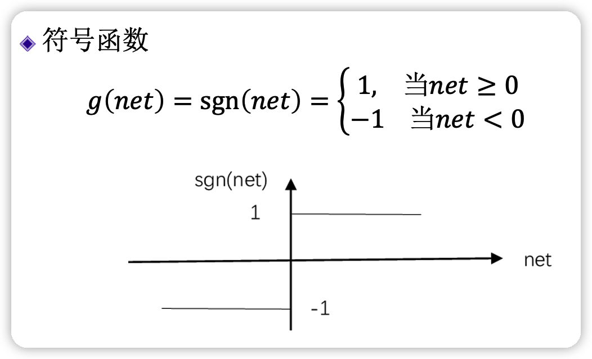
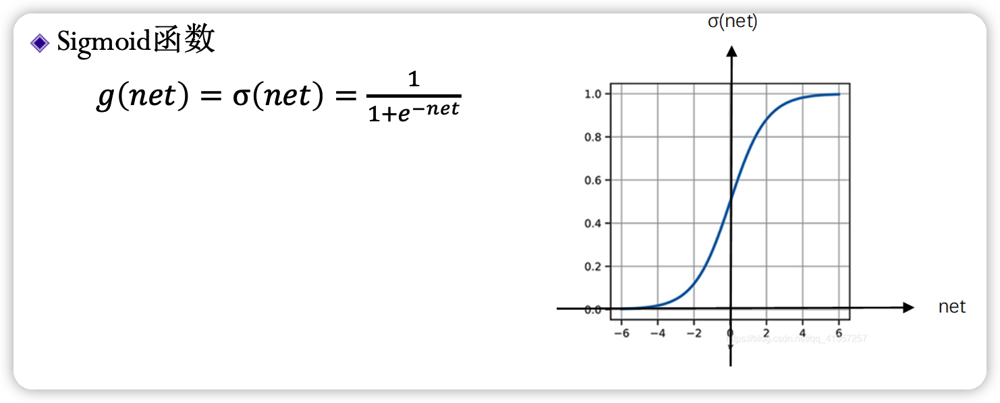
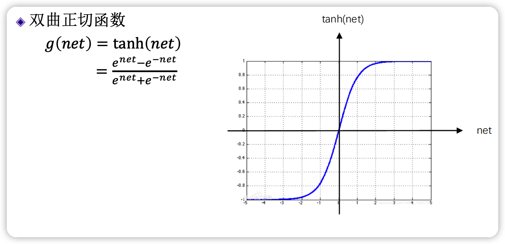
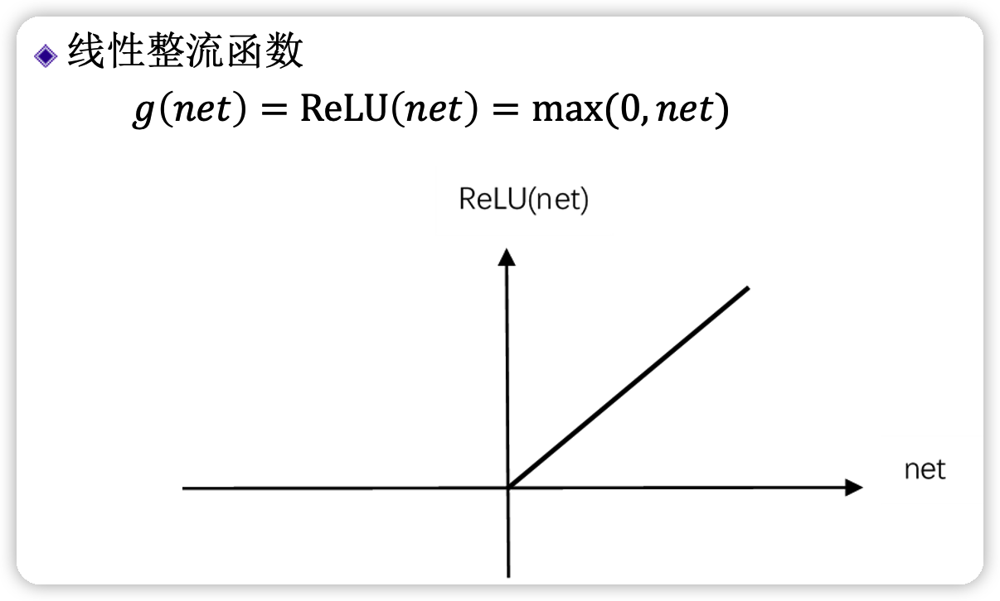
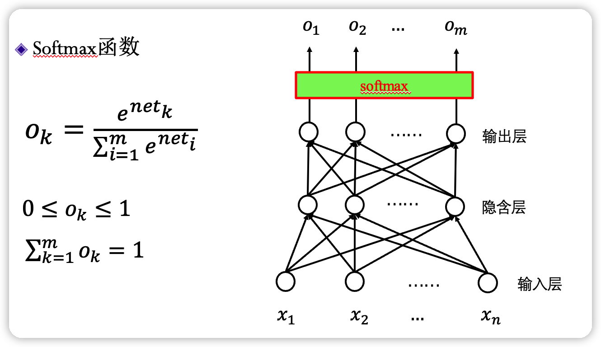

# readme

这一章马老师讲的很玄学，尽我所能写一写…

# What is neural network？

## 术语

1. **全连接神经网络** —— 对 n-1 层和 n 层而言，n-1 层的任意一个节点，都和第 n 层所有节点有连接。即第 n 层的每个节点在进行计算的时候，[激活函数](https://so.csdn.net/so/search?q=激活函数&spm=1001.2101.3001.7020)的输入是 n-1 层所有节点的加权，这个激活函数是非线性的，可作用于大多数场景，然而**权重过多，计算量很大。**
2. **前馈神经网络** —— 在其内部，参数从输入层向输出层单向传播。有异于[循环神经网络](https://zh.wikipedia.org/wiki/循环神经网络)，它的内部不会构成[有向环](https://zh.wikipedia.org/wiki/環_(圖論))。
3. **多层感知器** ——（Multilayer Perceptron,缩写MLP）是一种前向结构的[人工神经网络](https://zh.m.wikipedia.org/wiki/人工神经网络)，映射一组输入向量到一组输出向量。MLP可以被看作是一个有向图，由多个的节点层所组成，每一层都全连接到下一层。除了输入节点，每个节点都是一个带有非线性激活函数的神经元（或称处理单元）。一种被称为[反向传播算法](https://zh.m.wikipedia.org/wiki/反向传播算法)的[监督学习](https://zh.m.wikipedia.org/wiki/监督学习)方法常被用来训练MLP。多层感知器遵循人类神经系统原理，学习并进行数据预测。它首先学习，然后使用权重存储数据，并使用算法来调整权重并减少训练过程中的偏差，即实际值和预测值之间的误差。主要优势在于其快速解决复杂问题的能力。多层感知的基本结构由三层组成：第一输入层，中间隐藏层和最后输出层，输入元素和权重的乘积被馈给具有神经元偏差的求和结点,主要优势在于其快速解决复杂问题的能力。MLP是[感知器](https://zh.m.wikipedia.org/wiki/感知器)的推广，克服了感知器不能对[线性不可分](https://zh.m.wikipedia.org/w/index.php?title=线性不可分&action=edit&redlink=1)数据进行识别的弱点。
4. **全连接层** —— Fully Connected Layer 类似 FCN
5. **稠密层** —— 即 FCL 的同义词

## 结构与激活函数

通过增设 0 项可以统一形式，不必单独写偏置量。

早期使用。

一般论文中的 $\sigma$ 专指 sigmoid。连续，用的多。

取值范围在 `(-1, 1)`，可经过简单变换变成 sigmoid。

整流这个词来自二极管。

在输出时，作用在整个层上，输出的和为 1，可视为概率。

