# 人工智障导论 2021

1. alpha-beta 剪枝。要求：1）标出每个节点的值；2）表明在何处剪枝；3）画出最终选择的走步。（P.S. 给的树是“不齐”的。）

2. 修正的 A\* 算法。给出求解过程、依次拓展的节点、最终选择的路径。

3. 非线性可分的 SVM 。

    样本：正例： $\boldsymbol{x_1}=(0, 0)^T$ ；负例： $\boldsymbol{x_2}=(1, 1)^T$ ， $\boldsymbol{x_3}=(-1, -1)^T$ 。

    核函数： $K(\boldsymbol{x}, \boldsymbol{y}) = (1 + \boldsymbol{x}^T \boldsymbol{y})^2$ 。

    请求解 SVM 参数，并给出 $(0, 1)^T$ 的分类。

4. （1）模拟退火。（温度固定，类似往年题。）

    （2）遗传算法。（类似 PPT 例题。）

5. 决策树。用 ID3 算法建立决策树，只需给出根节点及其子节点，表明叶节点的类别。

6. 设计智障神经网络：输入单个数字的图片，输出对应的英文单词（one, two, ...）。要求使用 MLP、CNN、RNN 。画示意图，简要说明。

# 口头考纲

> credit to 计 06 班学习委员，salute

- CH1

> A 和 A* 算法
>
> 易错：A* 算法结束条件 (目标点在OPEN表中第一个)
>
> 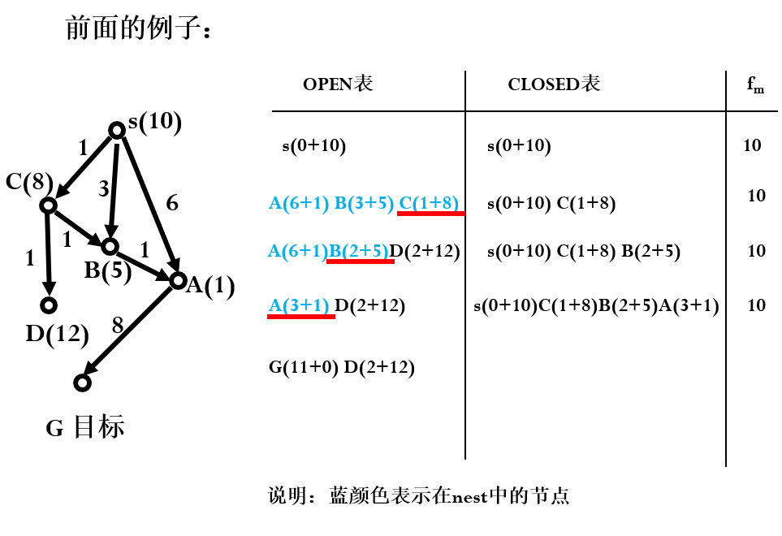
>
> 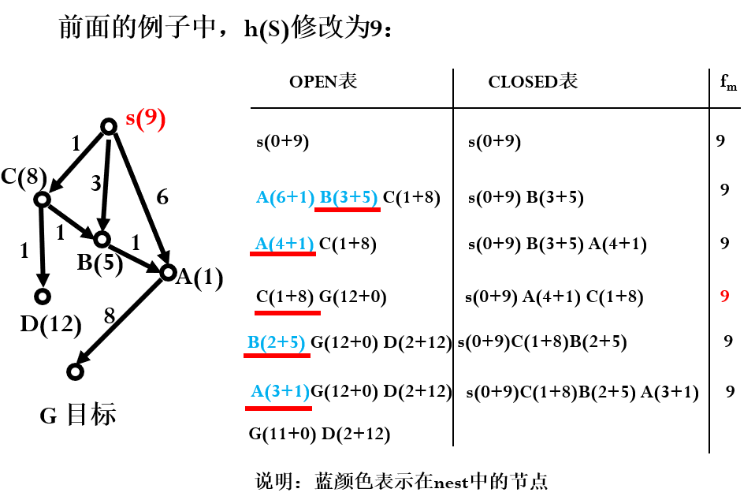

- CH2

> 基本CNN RNN LSTM 及典型应用
>
> BP 算法的推导
>
> 典型神经网络系统
>
> ResNet、GoogleNet
>
> 给出图，能说出每部分（？？）
>
> 词向量
>
> 掌握实现方法

- CH3

>  alpha-beta剪枝
>
>  易错：注意找全所有祖先节点（不只是父节点），最佳走步只能标一步
>
>  蒙特卡洛树搜索
>
>  重点是选择过程
>
>  AlphaGo / AlphaGo Zero
>
>  大概懂就行：两个网络、结合蒙特卡洛
>
>  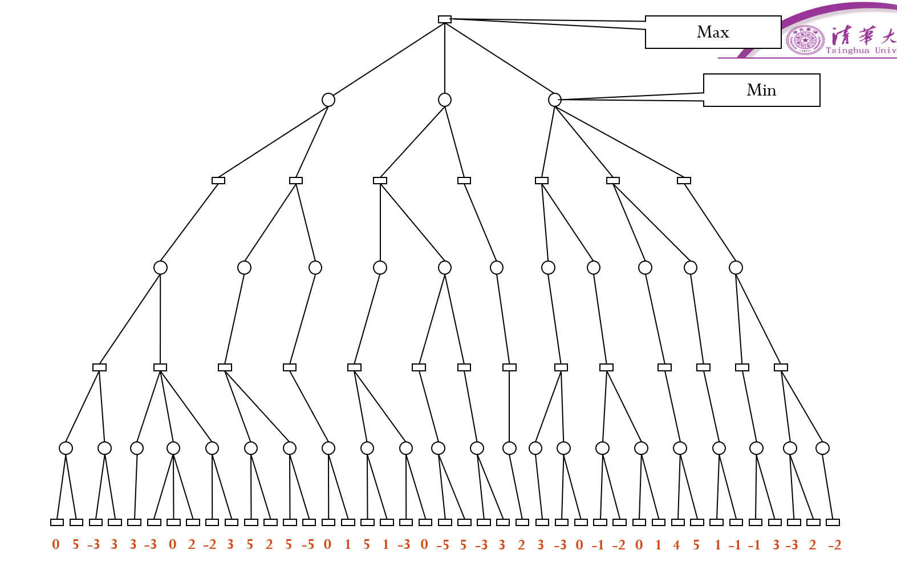
>
>  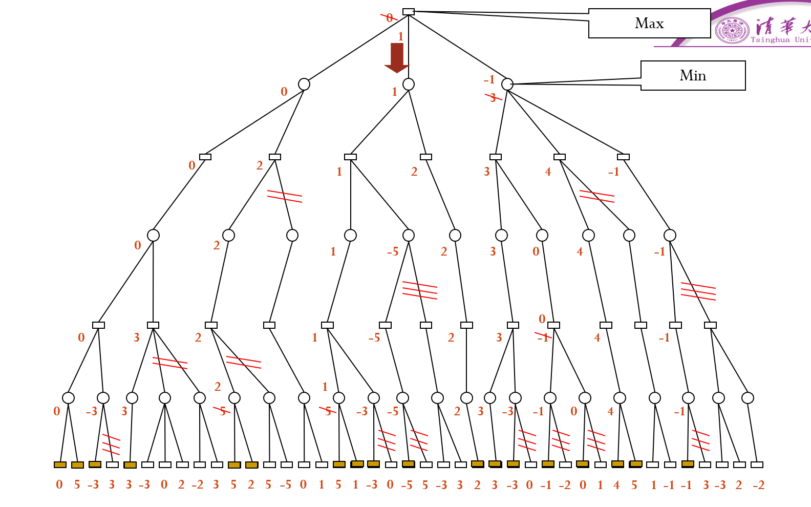
>
>  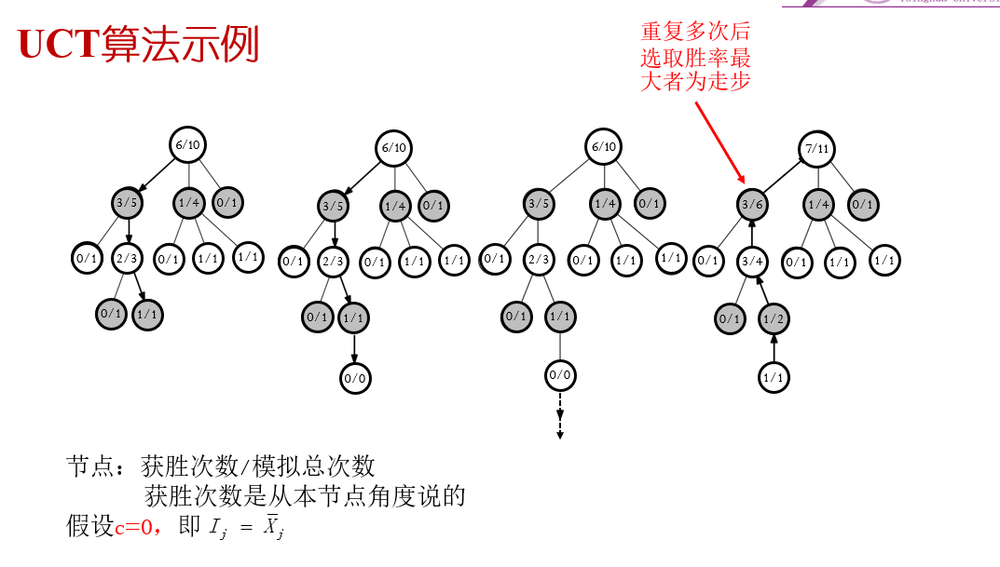

- CH4

>  SVM
>
>  会用对偶的方法求就行（ppt上例题）
>
>  决策树
>
>  给定数据，会用ID3/C4.5建树
>
>  **SVM**例题见最上方2021回忆版
>
>  **ID3决策树**
>
>  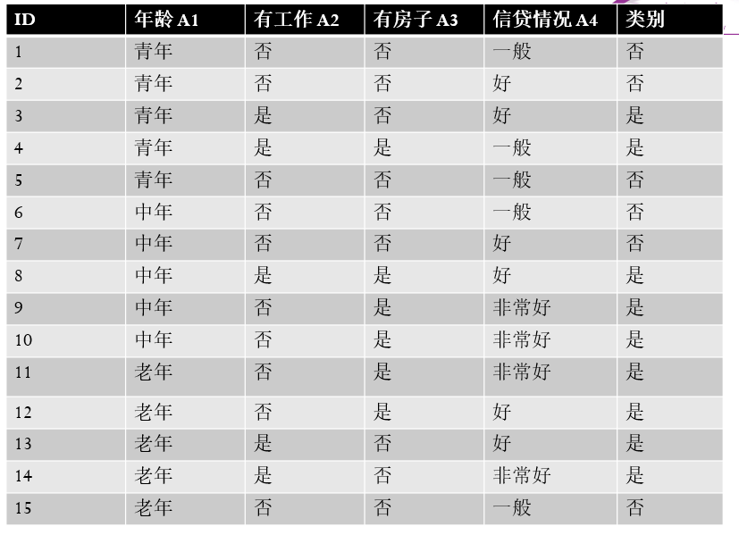
>
>  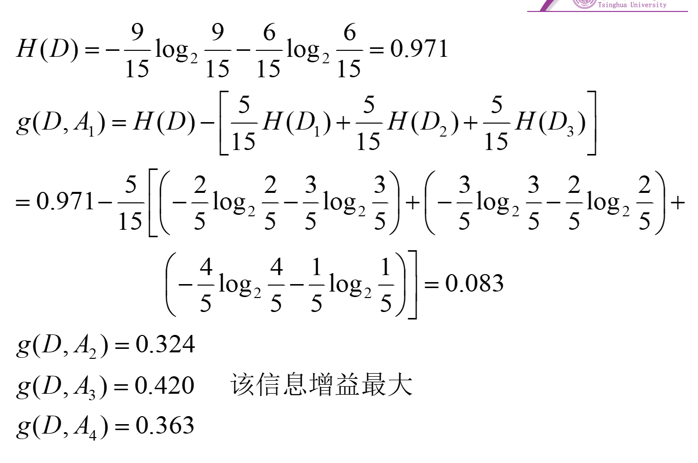
>
>  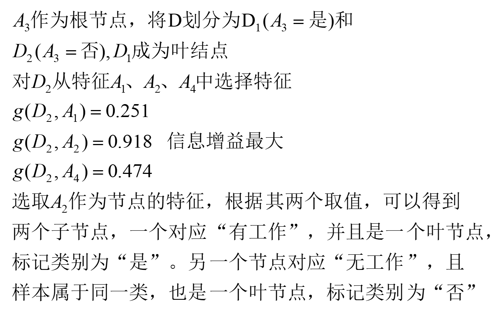
>
>  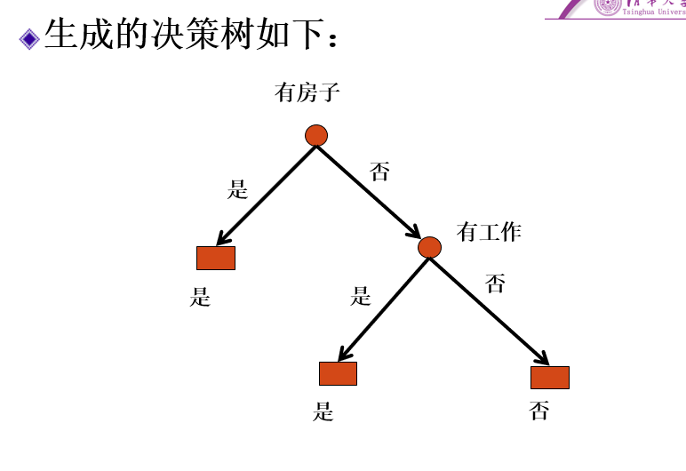

这棵决策树按照 ID3，第一个节点完了之后再分下 A2，熵就归零了。

**注：按马老师上课所说，第二章和第三章设计神经网络的部分不会单独出算法题，而应该是类似2021回忆版的最后一题，老师会出一个带有点创新的思考题，用到神经网络的知识。**

# 练习题

# A*

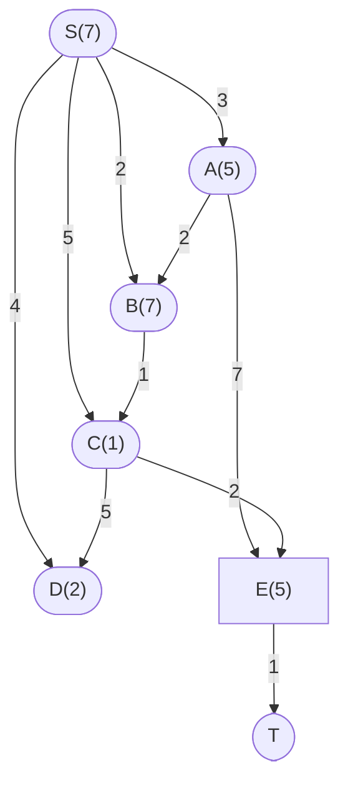

| NEST           | OPEN                   | CLOSE                                                | f(m) |
| -------------- | ---------------------- | ---------------------------------------------------- | ---- |
| 空             | S(7)                   | 空                                                   | 0    |
| D(4+2), C(5+1) | A(3+5), B(2+7)         | S(7)                                                 | 7    |
| C(5+1)         | A(3+5), B(2+7)         | D(4+2), S(7)                                         | 7    |
| 空             | A(3+5), B(2+7), E(7+5) | D(4+2), C(5+1), S(7)                                 | 7    |
| 空             | B(2+7), E(7+5)         | D(4+2), C(5+1), S(7), A(3+5)                         | 8    |
| C(3+1)         | E(7+5)                 | D(4+2), C(5+1), S(7), A(3+5), B(2+7)                 | 9    |
| 空             | E(5+5)                 | C(3+1), D(4+2), C(5+1), S(7), A(3+5), B(2+7)         | 9    |
| T(6+0)         | 空                     | C(3+1), D(4+2), C(5+1), S(7), A(3+5), B(2+7), E(5+5) | 10   |

# 决策树

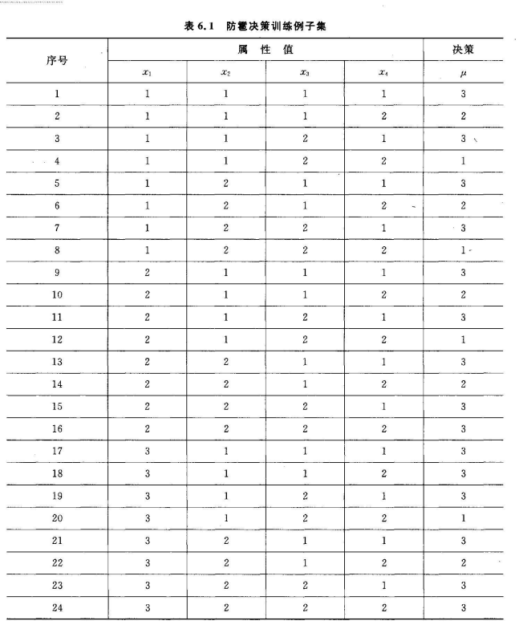

# 设计神经网络

## RNN

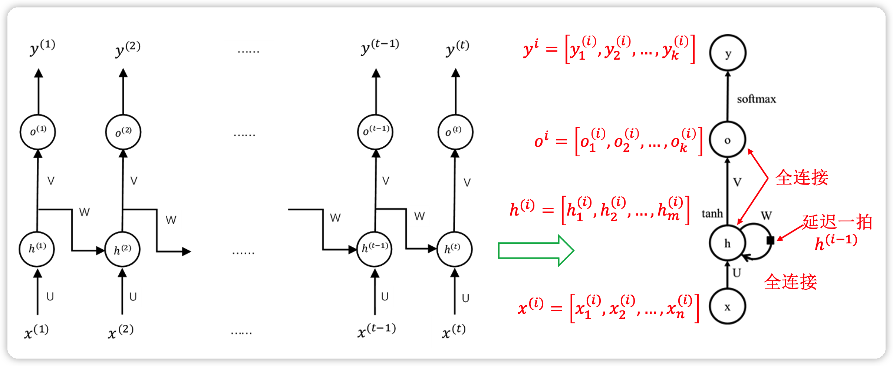

- 设计如图所示的 RNN 神经网络，以 x 张量的第 k 个列向量 $x_k$ 为例，$x_k$ 与参数矩阵 U 相乘输入记忆神经元并与之前记忆的 $h^{k-1}\times W$ 相加，然后经过 tanh 激活得到 $h^k$ 作为 h 张量的第 k 项并由记忆细胞记录，接着输入 x 的下一列向量，不断循环此操作直到完全处理整个 x 张量。先输入的 x 的列向量产生了 h 中的列向量，并且被记忆细胞记录，影响后输入的列向量的输出值，构造了循环神经网络。完全产生 h 张量后，h 与 V 矩阵作积得到 o，o 进过 softmax 后输出概率。最后计算损失函数并回传梯度下降。

## CNN

1. 一维多核卷积层：用宽度为 3、5、7 的卷积核分别与输入数据做多核卷积，得到多通道的一维输出特征。
2. 池化层：对卷积结果进行 max pooling 并拼接。
3. 线性层：拼接后长度为通道数的张量经过一层带有 dropout 的线性层，而后经过 softmax，得到类别标签预测的向量。
4. 后计算损失函数并回传梯度下降。

## MLP

1. 输入层：若干多个神经元 $n_i$ 分别接收输入张量 x 与各自的参数矩阵 w 相乘，输出指定大小的张量，然后进行 Batch Normalization, Activation, Dropout，并传递给隐藏层。
2. 若干多个隐藏层：与输入层工作类似，不断张量相乘，归一化，激活与 dropout。
3. 输出层：接受最后一个隐藏层的输出，每个神经元与其参数矩阵相乘并由 softmax 激活，得到类别标签预测的向量。
4. 后计算损失函数并回传梯度下降。

