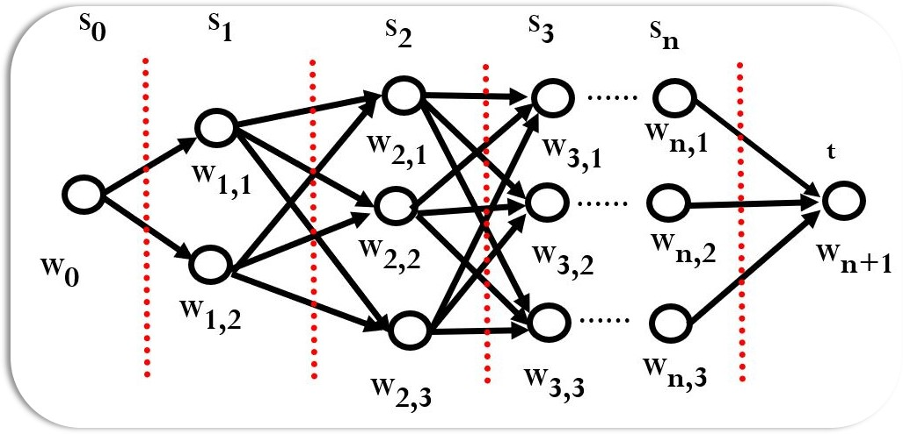

# 图搜索

#### 概念

- **耗散值**
  - 反应的是一个路径的代价，可以是一段路程的长度，也可以是走完该路程所需要花费的时间，或者花费的金额等。
  - 一条路径的耗散值等于连接这条路径各节点间所有弧线耗散值的总和，例如从节点$a$到节点$c$的路径耗散值$C(a,c)=C(a,b)+C(b,c)$，$b$为连接$a$和$c$的节点
- **扩展节点**
  - 后继节点操作符（相当于可应用规则）作用到节点（对应于某一状态描述）上，生成出其所有后继节点（新状态），并给出连接弧线的耗散值（相当于使用规则的代价），这个过程叫做扩展一个节点。
  - 扩展节点可使定义的隐含图生成为显式表示的状态空间图。

#### **图搜索算法一般框架**

- G为搜索图，初始化时仅含有起始节点s，图中每个节点有⼀个指向其父节点的指针,
- OPEN表用于存放刚生成的节点，对于不同的搜索策略，节点在OPEN表中的排序是不同的。
- CLOSED表用于存放将要扩展或者已扩展的节点。
- n的扩展节点集合$\{m_i\}=\{m_j\} \cup \{m_o\} \cup \{m_c\}$，其中$m_o$为OPEN表出现的点，$m_c$为CLOSED表出现的点，$m_j$为两个表都未出现的点。课程使用的是$m_k,\ m_l$代替$m_o,\ m_c$，但笔者认为不便展现其性质，故更改下标

$$
\begin{aligned}
& 1 \quad G:=s,\ OPEN:=(s),\ CLOSED:=(\ ) \\
& 2 \quad \mathbf{LOOP: \ if} \ OPEN=(\ ) \ \mathbf{then\ exit(fail)}  \\
& 3 \quad \quad n:=First(OPEN) \\
& 4 \quad \quad \mathbf{if} \ n=goal \ \mathbf{then \  exit(success)}\\
& 5 \quad \quad Remove(n,\ OPEN),\ Add(n,\ CLOSED)\\
& 6 \quad \quad Expand(n)\rightarrow{m_i},\ G:=Add(m_i,\ G) \\
& 7 \quad \quad \quad Add(m_j, \ OPEN), \  \mathbf{标记}m_j\mathbf{连接到}n\mathbf{的指针} \\
& 8 \quad \quad \quad \mathbf{计算是否要修改}m_{o},\ m_{c}\mathbf{到}n\mathbf{的指针}\\
& 9 \quad \quad \quad \mathbf{计算是否要修改}m_{c}\mathbf{到}\mathbf{后继节点的指针}\\
& 10 \quad \ \  \mathbf{重排}OPEN\mathbf{节点}\\
& 11 \quad \mathbf{go} \  \mathbf{LOOP} \\
\end{aligned}
$$

#### 算法解释

如果你未看懂算法，请看接下来的解释：

1. 建立⼀个只含有起始节点S的搜索图G,图中每个节点有⼀个指向其父节点的指针, S的这⼀指针为⼀特殊值(如0), 并把S放入未扩展节点表OPEN中。建立已扩展的节点表CLOSED,初始时该表为空。
2. LOOP循环开始，若OPEN表为空,则失败退出。
3. 取出OPEN表中的第⼀个节点赋值给n。
4. 若n为目标节点,则成功退出. 问题的解是沿指针追踪G中从n到S的路径而得到的。
5. 将n从OPEN表中取出放入CLOSED表。
6. 扩展节点n, 生成不是n的祖先的那些后继节点的集合M。如果没有后继节点,则转9步。把那些不在G中的M的成员作为n的后继节点加入G。
7. 设置⼀个通向n的指针,把它们加入OPEN表。
8. 根据算法不同，对已在G中的M的成员，调整有关指针。
9. 根据算法不同，对已在G中的M的成员，调整有关指针。
10. 根据算法不同，按某种方式, 重排OPEN表。

11. 转LOOP。

## 1 盲目搜索

### 1.1 深度优先搜索 DFS

#### 算法框架

$$
\begin{aligned}
& 1 \quad G:=s,\ OPEN:=(s),\ CLOSED:=(\ ) \\
& 2 \quad \mathbf{LOOP: \ if} \ OPEN=(\ ) \ \mathbf{then\ exit(fail)}  \\
& 3 \quad \quad n:=First(OPEN) \\
& 4 \quad \quad \mathbf{if} \ n=goal \ \mathbf{then \  exit(success)}\\
& 5 \quad \quad Remove(n,\ OPEN),\ Add(n,\ CLOSED)\\
& 6 \quad \quad Expand(n)\rightarrow{m_i},\ G:=Add(m_i,\ G) \\
& 7 \quad \quad \quad Add(m_j, \ OPEN), \  \mathbf{标记}m_j\mathbf{连接到}n\mathbf{的指针} \\
& 8 \quad \mathbf{go} \  \mathbf{LOOP} \\
\end{aligned}
$$

#### 核心思想

DFS是从一般的图搜索算法变化而成，只修改了**第7步**。所谓图深度优先搜索，就是在每次扩展一个节点时，选择到目前为止深度最深的节点优先扩展。第7步中的$Add(m_j, \ OPEN)$表示将被扩展节点$n$的所有新子节点$m_j$加到OPEN表的前面，从而实现了对OPEN表中的元素按节点深度排序，深度深的节点被放在了OPEN表的前面。

#### 算法解释

如果你未看懂算法，请看接下来的解释：

- 开始时，OPEN表中只有一个初始节点s，s被扩展，其子节点被放入OPEN表中。
- 在算法的第3步，OPEN表的第一个元素n被取出扩展，这时节点n的深度在OPEN表中是最大的，OPEN表中的其他节点的深度都不会超过n的深度。
- n的子节点被放到OPEN表的最前面。由于子节点的深度要大于父节点的深度，实际上OPEN表是按照节点的深度进行排序的，深度深的节点被排在了前面，而深度浅的节点被放在了后面。
- 这样当下一个循环再次取出OPEN表的第一个元素时，实际上选择的就是到目前为止深度最深的节点，从而实现了深度优先的搜索策略。

#### 性质

- 当问题的深度是无限时，将进入死胡同，导致无法找到解。因此，当问题有解时，DFS不但不能保证找到最优解，也不能保证一定能找到解。
- 最坏情况时，搜索空间等同于穷举
- 节省内存，只存储从初始节点到当前节点的路径

### 1.2 宽度优先搜索 BFS

#### 算法框架

$$
\begin{aligned}
& 1 \quad G:=s,\ OPEN:=(s),\ CLOSED:=(\ ) \\
& 2 \quad \mathbf{LOOP: \ if} \ OPEN=(\ ) \ \mathbf{then\ exit(fail)}  \\
& 3 \quad \quad n:=First(OPEN) \\
& 4 \quad \quad \mathbf{if} \ n=goal \ \mathbf{then \  exit(success)}\\
& 5 \quad \quad Remove(n,\ OPEN),\ Add(n,\ CLOSED)\\
& 6 \quad \quad Expand(n)\rightarrow{m_i},\ G:=Add(m_i,\ G) \\
& 7 \quad \quad \quad Add(OPEN, \ m_j), \  \mathbf{标记}m_j\mathbf{连接到}n\mathbf{的指针} \\
& 8 \quad \mathbf{go} \  \mathbf{LOOP} \\
\end{aligned}
$$

#### 核心思想

BFS是从一般的图搜索算法变化而成，只修改了**第7步**。所谓图广度优先搜索，就是在每次扩展一个节点时，选择深度最浅的节点优先扩展。第7步中的$Add(OPEN, \ m_j)$表示将被扩展节点$n$的所有新子节点$m_j$加到OPEN表的后面，从而实现了对OPEN表中的元素按节点深度排序，只不过这次将深度浅的节点放在OPEN表的前面了，而深度深的节点被放在了OPEN表的后边。

#### 算法解释

如果你未看懂算法，请看接下来的解释：

- 开始时，OPEN表中只有一个初始节点s，s被扩展，其子节点被放入OPEN表中。
- 在算法的第3步，OPEN表的第一个元素n被取出扩展，这时节点n的深度在OPEN表中是最大的，OPEN表中的其他节点的深度都不会超过n的深度。
- n的子节点被放到OPEN表的最后面。由于子节点的深度要大于父节点的深度，因此OPEN表是按照节点的深度进行排序的，深度深的节点被排在了后面。
- 这样当下一个循环再次取出OPEN表的第一个元素时，实际上选择的就是到目前为止深度最浅的节点，从而实现了优先查找同深度节点的搜索策略。

#### 性质

- 当问题有解时，一定能找到解；当问题为单位耗散值，且问题有解时，一定能找到最优解
- 效率较低
- 存储量大

## 2 启发式搜索

利用启发知识（评估节点到达目标的距离），在保证找到最佳解的情况下，尽可能减少搜索范围，提高搜索效率。

### 2.1 A算法

#### 基本思想

定义一个评价函数 $f$，对当前的搜索状态进行评估，找到最有希望通向目标节点 $goal$ 的待扩展节点优先扩展。A 算法同样由一般的图搜索算法改变而成，在算法的第 7 步，按照 f 值从小到大对 OPEN 表中的节点进行排序，优先扩展 $f(n)$ 最小的节点，直到 $f(goal)$ 最小

##### 评价函数$f$

- $f(n) = g(n) + h(n)$，$n$为被评价的节点，$h(n)$为启发函数。$h(n)$依赖于启发信息，是与问题有关的，需要根据具体的问题来定义，是对未来扩展的方向作出估计（如求图最短路径，可定义$h(n)$为$n$到终点欧式距离）
- $g^*(n)$为从初始节点$s$到节点$n$的最短路径的耗散值，$ h^*(n)$为节点$n$到目标节点$g$的最短路径的耗散值，则$f^*(n) = g^*(n) + h^*(n)$表示从初始节点$s$经过节点$n$到目标节点$g$的最短路径的耗散值。
- $f(n),\ g(n),\  h(n)$表示$f^*(n),\ g^*(n),\  h^*(n)$三个函数值的估计值
- 评价函数可以是一个节点处在最佳路径上的概率，或是求出任意一个节点与目标节点集之间的距离度量或差异度量，或是根据格局（博弈问题）或状态的特点来打分。

#### 算法框架

$$
\begin{aligned}
& 1 \quad G:=s,\ OPEN:=(s),\ f(s):=g(s)+h(s),\ CLOSED:=(\ ) \\
& 2 \quad \mathbf{LOOP: \ if} \ OPEN=(\ ) \ \mathbf{then\ exit(fail)}  \\
& 3 \quad \quad n:=First(OPEN) \\
& 4 \quad \quad \mathbf{if} \ n=goal \ \mathbf{then \  exit(success)}\\
& 5 \quad \quad Remove(n,\ OPEN),\ Add(n,\ CLOSED)\\
& 6 \quad \quad Expand(n)\rightarrow{m_i},\ f(n,\ m_i):=g(n,\ m_i)+h(m_i),\ G:=Add(m_i,\ G) \\
& 7 \quad \quad \quad Add(m_j, \ OPEN), \  \mathbf{标记}m_j\mathbf{连接到}n\mathbf{的指针} \\
& 8 \quad \quad \quad \mathbf{if}\  f(n,\ m_o)<f(m_o)\  \mathbf{then}\\
& \quad \quad \quad \quad \ \  f(m_o):＝f(n,\ m_o),\ \mathbf{标记}m_{o}\mathbf{到}n\mathbf{的指针}\\
& 9 \quad \quad \quad \mathbf{if}\  f(n,\ m_c)<f(m_c)\  \mathbf{then} \\ 
& \quad \quad \quad \quad \ \  f(m_c):＝f(n,\ m_c),\ \mathbf{标记}m_{c}\mathbf{到}n\mathbf{的指针},\ Add(m_c, \ OPEN)\\
& 10 \quad \ \  OPEN\mathbf{节点按}f\mathbf{值大小排序}\\
& 11 \quad \mathbf{go} \  \mathbf{LOOP} \\
\end{aligned}
$$

#### 算法解释

如果你未看懂算法，请看接下来的解释：

- 第1步，计算初始节点的$f$值
- 第6步，计算所有扩展节点的$f$值
- 第8步，若$m_o$存在更小的$f$值，更新OPEN表中的节点
- 第9步，若$m_c$存在更小的$f$值，更新CLOSED表中的节点，并将其重新加入OPEN表
- 第10步，将OPEN表的节点按$f$值大小排序，保证取出的节点是$f$值最小的

### 2.2 A*算法

若A算法满足$h(n)\leq h^*(n)$，则称为A*算法

当$h(n)\equiv0$，退化成动态规划算法

#### 定理

- 可采纳性定理：对有限图和无限图，若存在从初始节点$s$到目标节点$t$有路径，则A*必能找到最佳解结束。
- 对同一个问题有两个A*算法$A_1$和$A_2$，若$A_2$比$A_1$有较多的启发信息，即**对所有非目标节点均有$h_2(n)>h_1(n)$**，则在具有一条从s到t路径的隐含图上，搜索结束时，由$A_2$所扩展的每一个节点，也必定由$A_1$所扩展，即**$A_1$扩展的节点 $\geq A_2$扩展的节点**。

### 2.3 A*算法的改进

#### 基本思想

在前面的扩展中，并没有找到从初始节点到当前节点的最短路径，那么在A*算法第9步会将节点重复放回OPEN，导致搜索效率下降。改进方向有限制$h$和算法改进，前者是对$h$增加适当的限制，使得第一次扩展一个节点时，就找到了从$s$到该节点的最短路径；后者是改进算法，避免或减少节点的多次扩展。

#### 限制$h$：$h$单调

##### 定义

对于所有节点，任取一对父子节点$a,\ b$，若满足$h(a)-h(b)\leq C(a,\ b)$且$h(t)=0$，那么称该$h$函数满足单调限制条件。其意义是从$a$到目标节点，最佳路径耗散值估计$h(a)$不大于$b$到目标节点最佳路径耗散值估计$h(b)$与$a$到$b$孤线耗散值两者之和。

##### 定理

- 若$h(n)$满足单调限制条件，则A\*扩展了节点$n$之后，就已经找到了到达节点$n$的最佳路径。即若A\*选$n$来扩展，在单调限制条件下有$g(n)=g^*(n)$
- 若$h(n)$满足单调限制，则由A\*所扩展的节点序列，其$f$值是非递减的，即$f(a)≤f(b)$
- $h(n)\equiv0$，$h$是单调的

#### 算法改进

##### 理论基础

- OPEN表上任意具有$f(n) < f^*(s)$的节点定会被A\*扩展
- A\*选作扩展的任一节点，定有$f(n)≤f^*(s)$

##### 核心思想

- 以$f^*(s)$为界将OPEN表划分为两部分，$f$值小于$f^*(s)$的节点组成的部分，我们称其为NEST。NEST中的节点必然会扩展，那么单独改变他们拓展顺序，不影响算法扩展节点个数。若NEST中$h$为单调的，那么就可以避免重复节点问题。
- 对于NEST节点，令其$h$值为0，这样$h$是单调的，按照$f(n)=g(n)$进行扩展。
- 由于$f^*(s)$是未知的，因此只能采取近似的方法获取NEST子集。目前为止扩展过的节点中，最大的$f$值作为$f^*(s)$的近似值，记做$f_m$，随着搜索进行，$f_m$越来越接近$f^*(s)$

$$
\begin{aligned}
& 1 \quad G:=s,\ OPEN:=(s),\ f(s):=h(s),\ CLOSED:=(\ ), \ f_m:=0 \\
& 2 \quad \mathbf{LOOP: \ if} \ OPEN=(\ ) \ \mathbf{then\ exit(fail)}  \\
& 3 \quad \quad NEST:=\{n_i∣f(n_i)＜f_m,\ n_i\in OPEN\}\\
& 4 \quad \quad \mathbf{if} \ NEST\neq\{\ \} \ \mathbf{then \  } n:=n(\min g_i)\\
& \quad \quad \quad \quad \quad \quad \quad \quad \quad \ \   \mathbf{else} \ n:=First(OPEN),\ f_m:=f(n)\\
& 5 \quad \quad \mathbf{if} \ n=goal \ \mathbf{then \  exit(success)}\\
& 6 \quad \quad Remove(n,\ OPEN),\ Add(n,\ CLOSED)\\
& 7 \quad \quad Expand(n)\rightarrow{m_i},\ f(n,\ m_i):=g(n,\ m_i)+h(m_i),\ G:=Add(m_i,\ G) \\
& 8 \quad \quad \quad Add(m_j, \ OPEN), \  \mathbf{标记}m_j\mathbf{连接到}n\mathbf{的指针} \\
& 9 \quad \quad \quad \mathbf{if}\  f(n,\ m_o)<f(m_o)\  \mathbf{then}\\
& \quad \quad \quad \quad \ \  f(m_o):＝f(n,\ m_o),\ \mathbf{标记}m_{o}\mathbf{到}n\mathbf{的指针}\\
& 10 \quad \quad \ \ \mathbf{if}\  f(n,\ m_c)<f(m_c)\  \mathbf{then} \\ 
& \quad \quad \quad \quad \ \  f(m_c):＝f(n,\ m_c),\ \mathbf{标记}m_{c}\mathbf{到}n\mathbf{的指针},\ Add(m_c, \ OPEN)\\
& 11 \quad \ \  OPEN\mathbf{节点按}f\mathbf{值大小排序}\\
& 12 \quad \mathbf{go} \  \mathbf{LOOP} \\
\end{aligned}
$$

##### 算法解释

如果你未看懂算法，请看接下来的解释：

- 第1步，初始化$f_m$为0
- 第3步，获取NEST集合，即满足$f＜f_m$的节点集合
- 第4步，NEST不空时，取NEST中$g$最小者作为当前节点，否则取OPEN的第一个当前节点。
- 其余和A\*算法一致

## 3 动态规划

### viterbi算法

$$
Q(W_{i,\ j})=\mathop{\min}\limits_{k}(Q(W_{i-1,\ k})+D(W_{i-1,\ k},\ W_{i,\ j})) ,\quad i \neq0\\
$$

$Q(W_{i,\ j})$表示起点到点$W_{i,\ j}$的最佳路径值，$Q(W_0)=0$，$D(a,b)$表示点a到点b的距离

#### 算法框架

$$
\begin{aligned}
& 1 \quad Q(W_0):=0 \\
& 2 \quad \mathbf{for} \ i\  \mathbf{in} \  (1,n+1) \\
& 3 \quad \quad \mathbf{for} \ j\  \mathbf{in} \ (1,\  \mathbf{len}(W_i)) \\
& 4 \quad \quad \quad Q(W_{i,\ j}):=\mathop{\min}\limits_{k}(Q(W_{i-1,\ k})+D(W_{i-1,\ k},\ W_{i,\ j}))
\end{aligned}
$$

对于每个点，仅保留起点到该点的最佳路径；每个节点的最佳路径则是比较所有父节点的最佳路径与耗散值的和，从中取最佳路径

