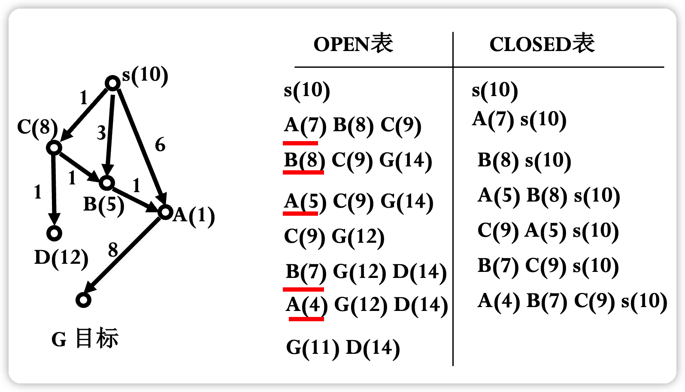

# 图搜索

#### 概念

- **耗散值**
  - 反应的是一个路径的代价，可以是一段路程的长度，也可以是走完该路程所需要花费的时间，或者花费的金额等。
  - 一条路径的耗散值等于连接这条路径各节点间所有弧线耗散值的总和，例如从节点$a$到节点$c$的路径耗散值$C(a,c)=C(a,b)+C(b,c)$，$b$为连接$a$和$c$的节点
- **扩展节点**
  - 后继节点操作符（相当于可应用规则）作用到节点（对应于某一状态描述）上，生成出其所有后继节点（新状态），并给出连接弧线的耗散值（相当于使用规则的代价），这个过程叫做扩展一个节点。
  - 扩展节点可使定义的隐含图生成为显式表示的状态空间图。

#### **图搜索算法一般框架**

- G 为搜索图，初始化时仅含有起始节点 s，图中每个节点有⼀个指向其父节点的指针。
- OPEN 表用于存放刚生成的节点，对于不同的搜索策略，节点在 OPEN 表中的排序是不同的。
- CLOSED 表用于存放**将要扩展或者已扩展**的节点。
- n 的扩展节点集合 $\{m_i\}=\{m_j\} \cup \{m_o\} \cup \{m_c\}$，其中$m_i$ 为所有 n 的扩展节点，$m_o$ 为 OPEN 表出现的点，$m_c$ 为 CLOSED 表出现的点，$m_j$ 为两个表都未出现的点。课程使用的是 $m_k,\ m_l$ 代替 $m_o,\ m_c$，但笔者认为不便展现其性质，故更改下标

$$
\begin{aligned}
& 1 \quad G:=s,\ OPEN:=(s),\ CLOSED:=(\ ) \\
& 2 \quad \mathbf{LOOP: \ if} \ OPEN=(\ ) \ \mathbf{then\ exit(fail)}  \\
& 3 \quad \quad n:=First(OPEN) \\
& 4 \quad \quad \mathbf{if} \ n=goal \ \mathbf{then \  exit(success)}\\
& 5 \quad \quad Remove(n,\ OPEN),\ Add(n,\ CLOSED)\\
& 6 \quad \quad Expand(n)\rightarrow{m_i},\ G:=Add(m_i,\ G) \\
& 7 \quad \quad \quad Add(m_j, \ OPEN), \  \mathbf{标记}m_j\mathbf{连接到}n\mathbf{的指针} \\
& 8 \quad \quad \quad \mathbf{计算是否要修改}m_{o},\ m_{c}\mathbf{到}n\mathbf{的指针}\\
& 9 \quad \quad \quad \mathbf{计算是否要修改}m_{c}\mathbf{到}\mathbf{后继节点的指针}\\
& 10 \quad \ \  \mathbf{重排}OPEN\mathbf{节点}\\
& 11 \quad \mathbf{go} \  \mathbf{LOOP} \\
\end{aligned}
$$

#### 算法解释

**如果你未看懂算法**，请看接下来的解释：

1. 建立⼀个只含有起始节点 S 的搜索图 G，图中每个节点有⼀个指向其父节点的指针，S 的这⼀指针为⼀特殊值(如 0 ), 并把 S 放入未扩展节点表 OPEN 中。建立已扩展的节点表 CLOSED，初始时该表为空。
2. LOOP 循环开始，若 OPEN 表为空，则失败退出。
3. 取出 OPEN 表中的第⼀个节点赋值给 n。
4. 若 n 为目标节点，则成功退出。问题的解是沿指针追踪 G 中从 n 到 S 的路径而得到的。
5. 将 n 从 OPEN 表中取出放入 CLOSED 表。
6. 扩展节点 n, 生成不是 n 的祖先的那些后继节点的集合 M。如果没有后继节点，则转 3 步。把那些不在 G 中的 M 的成员作为 n 的后继节点加入 G。
7. 设置⼀个通向 n 的指针，把它们加入 OPEN 表。
8. 根据算法不同，对已在 G 中的 M 的成员，调整有关指针。
9. 根据算法不同，按某种方式, 重排 OPEN 表。
11. 转 LOOP。

# 盲目搜索

## 深度优先搜索 DFS

### 算法框架

$$
\begin{aligned}
& 1 \quad G:=s,\ OPEN:=(s),\ CLOSED:=(\ ) \\
& 2 \quad \mathbf{LOOP: \ if} \ OPEN=(\ ) \ \mathbf{then\ exit(fail)}  \\
& 3 \quad \quad n:=First(OPEN) \\
& 4 \quad \quad \mathbf{if} \ n=goal \ \mathbf{then \  exit(success)}\\
& 5 \quad \quad Remove(n,\ OPEN),\ Add(n,\ CLOSED)\\
& 6 \quad \quad Expand(n)\rightarrow{m_i},\ G:=Add(m_i,\ G) \\
& 7 \quad \quad \quad Add(m_j, \ OPEN), \  \mathbf{标记}m_j\mathbf{连接到}n\mathbf{的指针} \\
& 8 \quad \mathbf{go} \  \mathbf{LOOP} \\
\end{aligned}
$$

### 核心思想

DFS是从一般的图搜索算法变化而成，只修改了**第 7 步**。所谓图深度优先搜索，就是在每次扩展一个节点时，选择到目前为止深度最深的节点优先扩展。第7步中的 $Add(m_j, \ OPEN)$ 表示将被扩展节点 $n$ 的所有新子节点 $m_j$ 加到 OPEN 表的前面，从而实现了对 OPEN 表中的元素按节点深度排序，深度深的节点被放在了 OPEN 表的前面。

### 算法解释

如果你未看懂算法，请看接下来的解释：

- 开始时，OPEN 表中只有一个初始节点 s，s 被扩展，其子节点被放入 OPEN 表中。
- 在算法的第 3 步，OPEN 表的第一个元素 n 被取出扩展，这时节点 n 的深度在 OPEN 表中是最大的，OPEN 表中的其他节点的深度都不会超过 n 的深度。
- n 的子节点被放到OPEN表的最前面。由于子节点的深度要大于父节点的深度，实际上 OPEN 表是按照节点的深度进行排序的，深度深的节点被排在了前面，而深度浅的节点被放在了后面。
- 这样当下一个循环再次取出 OPEN 表的第一个元素时，实际上选择的就是到目前为止深度最深的节点，从而实现了深度优先的搜索策略。

### 性质

- 当问题的深度是无限时，将进入死胡同，导致无法找到解。因此，当问题有解时，DFS 不但不能保证找到最优解，也不能保证一定能找到解
- 一个通用的与问题无关的方法
- 最坏情况时，搜索空间等同于穷举
- 节省内存，只存储从初始节点到当前节点的路径

## 宽度优先搜索 BFS

### 算法框架

$$
\begin{aligned}
& 1 \quad G:=s,\ OPEN:=(s),\ CLOSED:=(\ ) \\
& 2 \quad \mathbf{LOOP: \ if} \ OPEN=(\ ) \ \mathbf{then\ exit(fail)}  \\
& 3 \quad \quad n:=First(OPEN) \\
& 4 \quad \quad \mathbf{if} \ n=goal \ \mathbf{then \  exit(success)}\\
& 5 \quad \quad Remove(n,\ OPEN),\ Add(n,\ CLOSED)\\
& 6 \quad \quad Expand(n)\rightarrow{m_i},\ G:=Add(m_i,\ G) \\
& 7 \quad \quad \quad Add(OPEN, \ m_j), \  \mathbf{标记}m_j\mathbf{连接到}n\mathbf{的指针} \\
& 8 \quad \mathbf{go} \  \mathbf{LOOP} \\
\end{aligned}
$$

### 核心思想

BFS是从一般的图搜索算法变化而成，只修改了**第 7 步**。所谓图广度优先搜索，就是在每次扩展一个节点时，选择深度最浅的节点优先扩展。第7步中的 $Add(OPEN, \ m_j)$ 表示将被扩展节点 $n$ 的所有新子节点 $m_j$ 加到 OPEN 表的后面，从而实现了对 OPEN 表中的元素按节点深度排序，只不过这次将深度浅的节点放在 OPEN 表的前面了，而深度深的节点被放在了 OPEN 表的后边。

### 算法解释

如果你未看懂算法，请看接下来的解释：

- 开始时，OPEN 表中只有一个初始节点 s，s 被扩展，其子节点被放入 OPEN 表中。
- 在算法的第 3 步，OPEN 表的第一个元素 n 被取出扩展，这时节点 n 的深度在 OPEN 表中是最大的，OPEN 表中的其他节点的深度都不会超过 n 的深度。
- n 的子节点被放到 OPEN 表的最后面。由于子节点的深度要大于父节点的深度，因此 OPEN 表是按照节点的深度进行排序的，深度深的节点被排在了后面。
- 这样当下一个循环再次取出 OPEN 表的第一个元素时，实际上选择的就是到目前为止深度最浅的节点，从而实现了优先查找同深度节点的搜索策略。

### 性质

- 当问题有解时，一定能找到解
- 当问题为单位耗散值（每一步耗散值都是 1），且问题有解时，一定能找到最优解
- 一个通用的与问题无关的方法
- 效率较低
- 存储量大

# 启发式搜索

利用启发知识（评估节点到达目标的距离），在保证找到最佳解的情况下，尽可能减少搜索范围，提高搜索效率。

## A 算法

### 基本思想

定义一个评价函数 $f$，对当前的搜索状态进行评估，找到最有希望通向目标节点 $goal$ 的待扩展节点优先扩展。A 算法同样由一般的图搜索算法改变而成，在算法的第 7 步，按照 f 值从小到大对 OPEN 表中的节点进行排序，优先扩展 $f(n)$ 最小的节点，直到 $f(goal)$ 最小

### 评价函数 $f$

- $f(n) = g(n) + h(n)$，$n$ 为被评价的节点，$h(n)$ 为启发函数。$h(n)$ 依赖于启发信息，是与问题有关的，需要根据具体的问题来定义，是对未来扩展的方向作出估计（如求图最短路径，可定义 $h(n)$ 为 $n$ 到终点欧式距离）
- $g^*(n)$ 为从初始节点 $s$ 到节点 $n$ 的最短路径的耗散值，**$ h^*(n)$ 为节点 $n$ 到目标节点 $g$ 的最短路径的耗散值的精确值**，则 $f^*(n) = g^*(n) + h^*(n)$ 表示从初始节点 $s$ 经过节点 $n$ 到目标节点 $g$ 的最短路径的耗散值
- $f(n),\ g(n),\  h(n)$ 表示 $f^*(n),\ g^*(n),\  h^*(n)$ 三个函数值的估计值（\* 符号表示最优）
- 评价函数可以是一个节点处在最佳路径上的概率，或是求出任意一个节点与目标节点集之间的距离度量或差异度量，或是根据格局（博弈问题）或状态的特点来打分

### 算法框架

$$
\begin{aligned}
& 1 \quad G:=s,\ OPEN:=(s),\ f(s):=g(s)+h(s),\ CLOSED:=(\ ) \\
& 2 \quad \mathbf{LOOP: \ if} \ OPEN=(\ ) \ \mathbf{then\ exit(fail)}  \\
& 3 \quad \quad n:=First(OPEN) \\
& 4 \quad \quad \mathbf{if} \ n=goal \ \mathbf{then \  exit(success)}\\
& 5 \quad \quad Remove(n,\ OPEN),\ Add(n,\ CLOSED)\\
& 6 \quad \quad Expand(n)\rightarrow{m_i},\ f(n,\ m_i):=g(n,\ m_i)+h(m_i),\ G:=Add(m_i,\ G) \\
& 7 \quad \quad \quad Add(m_j, \ OPEN), \  \mathbf{标记}m_j\mathbf{连接到}n\mathbf{的指针} \\
& 8 \quad \quad \quad \mathbf{if}\  f(n,\ m_o)<f(m_o)\  \mathbf{then}\\
& \quad \quad \quad \quad \ \  f(m_o):＝f(n,\ m_o),\ \mathbf{标记}m_{o}\mathbf{到}n\mathbf{的指针}\\
& 9 \quad \quad \quad \mathbf{if}\  f(n,\ m_c)<f(m_c)\  \mathbf{then} \\ 
& \quad \quad \quad \quad \ \  f(m_c):＝f(n,\ m_c),\ \mathbf{标记}m_{c}\mathbf{到}n\mathbf{的指针},\ Add(m_c, \ OPEN)\\
& 10 \quad \ \  OPEN\mathbf{节点按}f\mathbf{值大小排序}\\
& 11 \quad \mathbf{go} \  \mathbf{LOOP} \\
\end{aligned}
$$

### 算法解释

如果你未看懂算法，请看接下来的解释：

- 第 1 步，计算 n 节点的 $f$ 值
- 第 6 步，计算 n 所有扩展的节点的 $f$ 值
- 第 7 步，$m_j$ 计算 $f$ 值后自然放入 OPEN 表中
- 第 8 步，若 $m_o$ 中存在节点 $m_k$ 有更小的 $f$ 值，则更新 $m_k$，仍然放在 OPEN 表中
- 第 9 步，若 $m_c$ 存在节点 $m_k$ 有更小的 $f$ 值，更新 $m_k$，并将其重新加入 OPEN 表（这个非常重要，而且马老师的课件与我的一本参考书里不太一样，这里放回去是马老师的做法，也是我觉得更正确的做法）
- 第 10 步，将 OPEN 表的节点按 $f$ 值大小排序，保证取出的节点是 $f$ 值最小的

注意，用选出的 OPEN 表 $f$ 最小值节点来更新的时候，例如下图用 $B$ 更新 $A$，$A $ 会被更新为 $(g_b+distance(b,a)+h(a))$，而不是直接用 $f(b)+distance(b,a)$

## Dijkstra 与 BFS ( Best-First Search)

### 基本思想

参考上方的 A 算法，Dijkstra 算法实际上是 $h(n)\equiv 0$ 的特殊情况，而 Best-First Search 是 $g(n)\equiv 0$ 的特殊情况。比较特别的是，Dijkstra 不存在**$m_c$ 存在节点 $m_k$ 有更小的 $f$ 值，更新 $m_k$，并将其重新加入 OPEN 表**这种情况。实际上，可以简化流程，一个表都不用。

### 算法理解

- Dijkstra 算法能够一次得到起点到所有点的最短路径，是一种不带任何启发思想的广度优先搜索策略
- BFS 基于贪心策略，在有障碍物的地图难以找到正确的最短路径
- 即使在有障碍物的情况下，选择合适的启发函数后，A\* 算法基本能搜索到最优路径

## A*算法

若A算法满足$h(n)\leq h^*(n)$，则称为A*算法

当$h(n)\equiv0$，退化成动态规划算法

#### 定理

- 可采纳性定理：对有限图和无限图，若从初始节点 $s$ 到目标节点 $t$ 有路径，则 A\* 必能找到最佳解
- 对同一个问题有两个 A\* 算法 $A_1$ 和 $A_2$，若 $A_2$ 比 $A_1$ 有较多的启发信息，即**对所有非目标节点均有 $h_2(n)>h_1(n)$**，则在具有一条从 s 到 t 路径的隐含图上，搜索结束时，由 $A_2$ 所扩展的每一个节点，也必定由 $A_1$ 所扩展，即 **$A_1$ 扩展的节点 $\geq A_2$ 扩展的节点**

## A*算法的改进

### 基本思想

在前面的扩展中，并没有找到从初始节点到当前节点的最短路径，那么在 A\* 算法第 9 步会将节点重复放回 OPEN，导致搜索效率下降。解决这个问题的改进方向有限制 $h$ 和算法改进，前者是对 $h$ 增加适当的限制，使得第一次扩展一个节点时，就找到了从 $s$ 到该节点的最短路径；后者是改进算法，避免或减少节点的多次扩展。

### 限制 $h$：$h$ 单调

#### 定义

对于所有节点，任取一对父子节点 $a,\ b$，若满足 $h(a)-h(b)\leq C(a,\ b)$ 且 $h(t)=0$，那么称该 $h$ 函数满足单调限制条件。其意义是从 $a$ 到目标节点，最佳路径耗散值估计 $h(a)$ 不大于 $b$ 到目标节点最佳路径耗散值估计 $h(b)$ 与 $a$ 到 $b$ 弧线耗散值两者之和，也即**a, b, t 三点**满足**三角不等式**

#### 定理

- 若 $h(n)$ 满足单调限制条件，则 A\* 扩展了节点 $n$ 之后，就已经找到了到达节点 $n$ 的最佳路径。即若 A\* 选 $n$ 来扩展，在单调限制条件下有 $g(n)=g^*(n)$，每个点最多被扩展一次
- 若 $h(n)$ 满足单调限制，则由 A\* 所扩展的节点序列，其 $f$ 值是非递减的，即后扩展的节点 $f$ 值一定更大
- $h(n)\equiv0$ 也是单调的
- 单调的 $h(n)$ 一定满足 A\* 条件

### 算法改进

#### 理论基础

- OPEN 表上任意具有 $f(n) < f^*(s)$ 的节点定会被 A\* 扩展
- A\* 选作扩展的任一节点，定有 $f(n)≤f^*(s)$（注意加入 OPEN 表的不一定会被扩展）

#### 核心思想

- 以$f^*(s)$ 为界将 OPEN 表划分为两部分，$f$ 值小于 $f^*(s)$ 的节点组成的部分，我们称其为 NEST。NEST 中的节点必然会扩展，那么单独改变他们拓展顺序，不影响算法扩展节点个数。若 NEST 中 $h$ 为单调的，那么就可以避免重复节点问题。
- 对于 NEST 节点，令其 $h$ 值为 0，这样 $h$ 是单调的，按照 $f(n)=g(n)$ 来选择 n 点
- 由于 $f^*(s)$ 是未知的，因此只能采取近似的方法获取 NEST 子集。目前为止扩展过的节点中，最大的 $f$ 值作为 $f^*(s)$ 的近似值，记做 $f_m$，随着搜索进行，$f_m$ 越来越接近 $f^*(s)$

$$
\begin{aligned}
& 1 \quad G:=s,\ OPEN:=(s),\ f(s):=h(s),\ CLOSED:=(\ ), \ f_m:=0 \\
& 2 \quad \mathbf{LOOP: \ if} \ OPEN=(\ ) \ \mathbf{then\ exit(fail)}  \\
& 3 \quad \quad NEST:=\{n_i∣f(n_i)＜f_m,\ n_i\in OPEN\}\\
& 4 \quad \quad \mathbf{if} \ NEST\neq\{\ \} \ \mathbf{then \  } n:=n(\min g_i)\\
& \quad \quad \quad \quad \quad \quad \quad \quad \quad \ \   \mathbf{\{else} \ n:=First(OPEN),\ f_m:=f(n)\}\\
& 5 \quad \quad \mathbf{if} \ n=goal \ \mathbf{then \  exit(success)}\\
& 6 \quad \quad Remove(n,\ OPEN),\ Add(n,\ CLOSED)\\
& 7 \quad \quad Expand(n)\rightarrow{m_i},\ f(n,\ m_i):=g(n,\ m_i)+h(m_i),\ G:=Add(m_i,\ G) \\
& 8 \quad \quad \quad Add(m_j, \ OPEN), \  \mathbf{标记}m_j\mathbf{连接到}n\mathbf{的指针} \\
& 9 \quad \quad \quad \mathbf{if}\  f(n,\ m_o)<f(m_o)\  \mathbf{then}\\
& \quad \quad \quad \quad \ \  f(m_o):＝f(n,\ m_o),\ \mathbf{标记}m_{o}\mathbf{到}n\mathbf{的指针}\\
& 10 \quad \quad \ \ \mathbf{if}\  f(n,\ m_c)<f(m_c)\  \mathbf{then} \\ 
& \quad \quad \quad \quad \ \  f(m_c):＝f(n,\ m_c),\ \mathbf{标记}m_{c}\mathbf{到}n\mathbf{的指针},\ Add(m_c, \ OPEN)\\
& 11 \quad \ \  OPEN\mathbf{节点按}f\mathbf{值大小排序}\\
& 12 \quad \mathbf{go} \  \mathbf{LOOP} \\
\end{aligned}
$$

##### 算法解释

如果你未看懂算法，请看接下来的解释：

- 第 1 步，初始化 $f_m$ 为 0，第一次令 $f_m=f(s)$，并计算所有扩展节点的 $f$
- 第 3 步，获取 NEST 集合，即满足 $f＜f_m$ 的节点集合（**注意是严格小于**）
- 第 4 步，NEST 不空时，取 NEST 中 $g$ 最小者作为当前节点 $k$，否则取 OPEN 的第一个当前节点 $k$（注意 NEST 外部的 OPEN 表是按照 $f$ 严格排序的，所以这个 $k$ 具有当前最小的 $f$），并且用 $f(k)$ 更新 $f(m)$
- 其余和 A\* 算法一致
- 实际上可以理解为，NEST 是当前 $f$ 值严格小于 $f_m$ 的节点集合，其内部按照 $g$ 排序，并不断选出 $g$ 最小的点来更新 NEST 与外部的 OPEN。当 NEST 为空时，选择外部 OPEN 中队首节点，其 $f$ 值最小，更新 $f_m$ 并创建新的 NEST 表格。直到 t 被选中为止
- CLOSE 表其实需要留住，否则 $m_c$ 节点可能被反复添加进入 OPEN。伪代码指出，如果更新后 $m_c$ 中节点的 **$f$ 值严格降低**，应该被重新加入 OPEN 中，有一定可能加入 NEST
- $f_m$ 更新后，不能将 CLOSE 中的值重新加入 OPEN 中

##  动态规划

### viterbi 算法
$$
Q(W_{i,\ j})=\mathop{\min}\limits_{k}(Q(W_{i-1,\ k})+D(W_{i-1,\ k},\ W_{i,\ j})) ,\quad i \neq0\\
$$

$Q(W_{i,\ j})$ 表示起点到点 $W_{i,\ j}$ 的最佳路径值，$Q(W_0)=0$，$D(a,b)$ 表示点 a 到点 b 的距离

#### 算法框架

$$
\begin{aligned}
& 1 \quad Q(W_0):=0 \\
& 2 \quad \mathbf{for} \ i\  \mathbf{in} \  (1,n+1) \\
& 3 \quad \quad \mathbf{for} \ j\  \mathbf{in} \ (1,\  \mathbf{len}(W_i)) \\
& 4 \quad \quad \quad Q(W_{i,\ j}):=\mathop{\min}\limits_{k}(Q(W_{i-1,\ k})+D(W_{i-1,\ k},\ W_{i,\ j}))
\end{aligned}
$$

对于每个点，仅保留起点到该点的最佳路径；每个节点的最佳路径则是比较所有父节点的最佳路径与耗散值的和，从中取最佳路径

